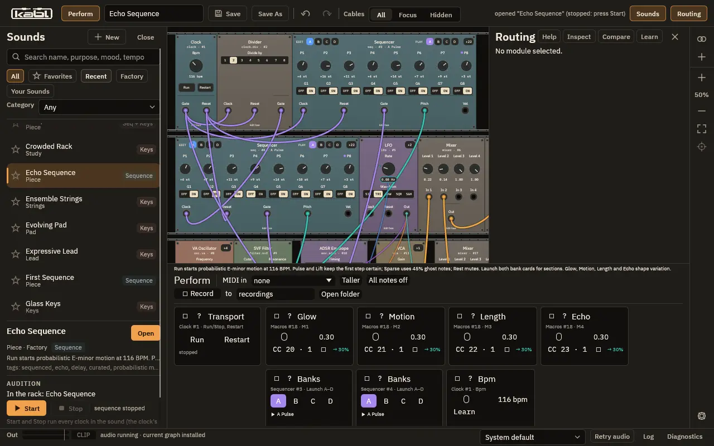

<p align="center"></p>

# kabl

A legible modular synthesizer, written in Rust. Cables are instruments, patches explain
themselves, and the sound you hear can be traced back through the patch.

kabl runs as a **standalone synthesizer** (`kabl-ui`, with a sound browser, the rack and
a performance view) and as a **CLAP instrument plugin** (`kabl.clap`, tested in REAPER and with
the CLAP validator). Linux is the supported platform for 1.0.

<p align="center"></p>

## What is in it

- **Modules (24 kinds):** analog-style, FM (two-operator and six-operator) and wavetable
  oscillators; state-variable and ladder filters; ADSR, LFO, noise; clock, clock divider and a
  step sequencer; VCA, gain, mixer, ring modulator; drive, chorus, delay, reverb; macros, cues,
  MIDI in and output. Composite modules can be built from these and saved.
- **Functional cables:** a cable can carry a step pattern, a pass probability, an A/B morph
  and glide, all locked to the patch clock, and macros can drive cable parameters.
- **Factory bank:** sounds, sequences and performances in `patches/` (installed as
  `share/kabl/patches`), searchable in the browser. Your own sounds are saved to
  `~/.local/share/kabl/sounds` and are never touched by an upgrade or an uninstall.
- **Real-time safe audio path:** no allocation or locking in the callback; the tests enforce it
  (`assert_no_alloc`).

## Install (Linux, from the tarball)

Download `kabl-<version>-linux-<arch>.tar.gz` from the Releases page, then:

```
tar -xzf kabl-*-linux-*.tar.gz
cd kabl-*-linux-*
./install.sh            # standalone + desktop entry + icons under ~/.local, plugin as ~/.clap/kabl.clap
./install.sh --uninstall
```

`./install.sh --prefix DIR --clap-dir DIR2` installs elsewhere. You can also run `bin/kabl-ui`
straight from the extracted folder without installing. Needs ALSA (`libasound2`), X11 or
Wayland with OpenGL, and `libxkbcommon-x11`.

## Run

```
kabl-ui                    # opens the sound browser
kabl-ui --size 1280x800    # smaller window
```

In a DAW, scan `~/.clap` (or the folder you chose) and load **kabl** as an instrument.
Logs are written to `~/.local/state/kabl/logs/kabl.log`; the full list of options and
environment overrides is in the tarball's `README.txt` and
[`docs/find-play-save/README.md`](docs/find-play-save/README.md).

## Build from source

Needs a current stable Rust toolchain and, on Debian or Ubuntu,
`libasound2-dev libxkbcommon-dev libdbus-1-dev`.

```
cargo run --release -p kabl-ui          # run from the checkout
cargo build --release -p kabl-clap      # target/release/libkabl_clap.so, the plugin
packaging/linux/package.sh              # the release tarball, in target/dist
cargo test --workspace
cargo fmt --all -- --check
```

`crates/`: `core` (op log, patch state, file format, no audio dependencies), `engine` (graph
compiler, scheduler, voices), `modules`, `cables`, `ui` (egui rack and sound browser),
`standalone` (audio and MIDI I/O), `clap` (plugin). `vendor/nice-plug` is a vendored copy of
the plugin framework (ISC), see `vendor/nice-plug/STRICT-PROFILE.md`.

## Documentation

- [`docs/STATUS.md`](docs/STATUS.md): current state and what is next.
- [`docs/PRODUCT-PLAN.md`](docs/PRODUCT-PLAN.md): intent and delivery order.
- [`docs/decisions.md`](docs/decisions.md): every non-trivial choice and the alternative rejected.
- [`docs/functional-cables/README.md`](docs/functional-cables/README.md), [`docs/find-play-save/README.md`](docs/find-play-save/README.md): feature guides.
- [`docs/benchmarks.md`](docs/benchmarks.md): measured performance.

## Licence

Source code: MIT OR Apache-2.0, at your option ([`LICENSE-MIT`](LICENSE-MIT),
[`LICENSE-APACHE`](LICENSE-APACHE)). Dependency licences are in
[`THIRD-PARTY-NOTICES.md`](THIRD-PARTY-NOTICES.md). Fonts, wavetables, the logo and the factory
patches are covered in [`ASSET-LICENSES.md`](ASSET-LICENSES.md); the logo and patch licences are
not yet declared there.
