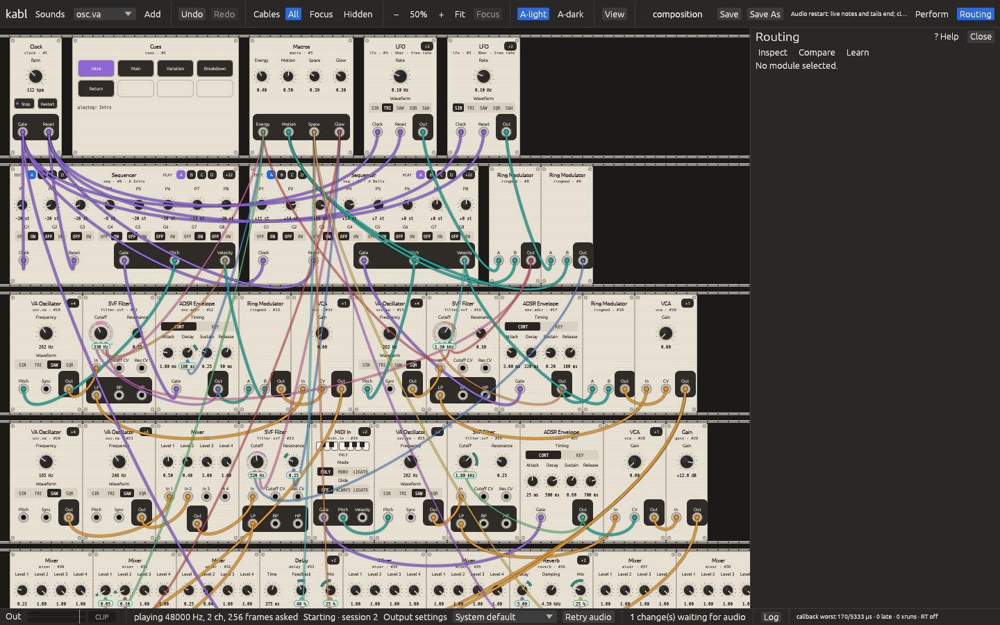
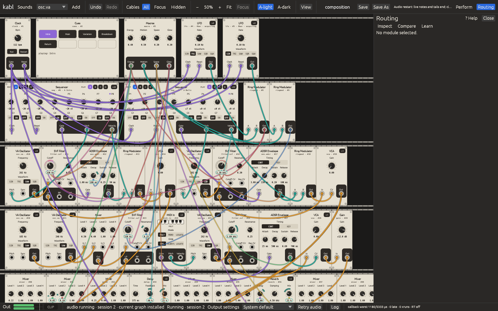

# D05 engineering report (updated 2026-09-28)

Base: fetched `origin/master` at `e951b2535d817bc7c21872cd0e46e815d35747ac`, then incorporated its documentation-only successor `f1e2c9e`. Branch: `codex/d05-audio-recovery`; [draft PR #8](https://github.com/stcksmsh/kabl/pull/8), not merged. The first review covered **product tree `47abdc4d34dc03d694d663863ebdf0f0443511ed`**, remote commit `7fd3a966eca193ef1babf83b5947333bb1e440b4`. R-03 at that head is addressed in the 2026-09-28 update below. Owner review remains pending.

## Acceptance matrix

| D05 criterion | Status and evidence |
|---|---|
| Initial unavailable output, edit/save, select another, play in same app | Source paths and focused tests implemented. Hosted graphical evidence covers injected stall → Retry → Running in one installed app. The distinct initial-unavailable/edit/save/select-output sequence remains for owner review. |
| Explicit lifecycle, bounded retries and stale session fencing | Focused `recovery_tests` and code in `ui/src/main.rs`; actual ALSA null backend tests pass. Physical loss and blocked close unverified. |
| Fault hooks | Opt-in stall/error, reopen failure and delay in `main.rs`. Callback error and repeated close/open tested on ALSA null; synthetic hooks cannot establish physical ALSA device loss. |
| Document latest revision / compile error / control reset | `poll_retry` synchronizes the current editor state before it opens the gate; pending Load/Toggle tests in `runtime_controls.rs`. GUI edit/undo during a retry unverified. |
| Pending Load across fade, second Load and explicit Start | `runtime_controls.rs` deterministic tests, including stopped incoming graph, timed Launch and deferred Preview. |
| Recorder prefix and new take | `record.rs` and `tests/record.rs` interruption test; reviewer fixes preserve the chosen folder and avoid cross-rate duration errors. No audible GUI take in this container. |
| Core/CC latency during Save/Open/reconnect | 500 ms Save and Open workers: mapped CC reached the actual ALSA null callback in 6.2/6.3 ms during Save and 4.1/6.3 ms during Open across two controlled runs. Structural compile is on a coalescing worker; delayed compile test verifies prompt CC handling and newest graph installation. Backend retry/teardown remains off `Core`. Physical controller/device latency pending. |
| Production callback bounds | Opt-in actual `cpal` closure test counts allocation and deallocation over warmed drain, note, render, report, gate, active recording tap and timing: zero of each on ALSA null. The first two startup callbacks are excluded. |
| Mono efficiency | Profile below; no optimization applied without a measured eligible win. |
| Workspace regression, clippy, package | Earlier tree: workspace 557/0/18. New code: workspace 560/0/20, strict Clippy clean, ALSA null backend 4/0. Hosted release package built and launched; graphical recovery evidence below. |
| Visual/audio/owner evidence | Installed package screenshots show Stalled, Starting and Running at 1440×900 and 1280×800 in both themes. No physical device, listening or controller walkthrough; Kosta's checks pending. |

## Verification environment and commands

Ubuntu 24.04 cloud container, x86_64, Rust 1.98.1, 4 virtual CPUs. Native ALSA development files were extracted into scratch for compilation; `ALSA_CONFIG_PATH` points to a `pcm.!default { type null }` software PCM. The local container has no `/dev/snd` or usable X display; the hosted Actions runner supplies Xvfb. Neither has a real controller. The installed local toolchain was in a scratch path; the reproducible repository commands are:

```
cargo test -p kabl-ui --bin kabl-ui --test runtime_controls --test record
ALSA_CONFIG_PATH=/path/to/alsa-null.conf cargo test -p kabl-ui --bin kabl-ui recovery_tests::actual_ -- --ignored --nocapture
cargo test --workspace
cargo clippy --workspace --all-targets -- -D warnings
cargo run --release -p kabl-engine --example mono_profile
```

At product head `cada932`, focused main/record/runtime/inspection tests gave 57 passed, 0 failed, 2 ignored. At final product tree `47abdc4`, `cargo test --workspace` gave **557 passed, 0 failed, 18 ignored**, `cargo clippy --workspace --all-targets -- -D warnings` passed, and the opt-in ALSA null recovery tests gave **2 passed, 0 failed**. The tests use a real `cpal` stream on ALSA null PCM but do not drive the graphical app. Strict Clippy needed four small lint fixes after the first recheck; the independent reviewer rechecked the exact resulting tree.

`cargo build --release -p kabl-ui --bin kabl-ui` passed on the earlier tree (5m 10s cold build). `OUT=/workspace/scratch/94df265b395c/d05-package bash packaging/linux/package.sh` assembled `kabl-0.1.0-linux-x86_64.tar.gz` outside the checkout: 94 archive entries, 4.9 MiB, `ldd` with no missing libraries. The later hosted run launches a newly built installed archive in Xvfb; this is software PCM playback, not listening evidence.

## Profile (no DSP optimization)

On this shared VM, `cargo run --release -p kabl-engine --example mono_profile`, 48 kHz, 256 frames as four blocks, eight voices, 1200 callbacks per run, one warmup + four measured runs (4800 callbacks per patch), notes [48, 55, 60, 64] periodically. Times are process wall time around `PatchEngine::process_block` four times, without a device callback or GUI. These are not laptop results or direct evidence of audible dropouts.

| Patch | Modules | Instances (voice instances) | Buffers | p50 / p99 / max / mean (µs) |
|---|---:|---:|---:|---:|
| Init Keyboard | 6 | 41 (40) | 21 | 85.1 / 163.9 / 1030.4 / 90.2 |
| Sound Palette | 94 | 360 (304) | 169 | 1197.2 / 1770.4 / 7282.5 / 1252.5 |
| Composition | 39 | 88 (56) | 37 | 214.5 / 304.0 / 1090.4 / 221.3 |

The dense graph is costly, but the harness does not isolate a safe mono-only subset or prove a repeatable reduction. Reducing lanes also changes per-voice gain/averaging unless carefully compensated. Therefore no engine optimization was made. The old cloud stalls and Composition spike have no inferred cause.

## Review and limits

The independent subagent's first review and tree recheck are in REVIEW.md; that recheck found its code findings resolved but kept R-03 major and open at the earlier product tree. The 2026-09-28 work below changes that evidence. Physical device disruption, controller feel, listening, and the owner checklist remain pending. Backend close can block without a deadline; one retry worker stays owned and the UI names the blocked state after ten seconds.

## 2026-09-28 R-03 repair and callback verification

Browser Save, Save As, folder Save, Open, New and folder Open now run on one owned worker using document/log/library snapshots. Completion under `Core` is short and only installs a loaded patch if its document and editor state still match; an intervening edit gets a new unsaved-change question. A Save commits its starting snapshot, leaving later edits visibly unsaved. The worker is joined at shutdown rather than detached. Delayed Open and Save UI tests pass with 500 ms I/O and an intervening edit.

`Delivery` now schedules structural compilation on one owned worker. Edits during a build replace its next job; a superseded result is discarded. Fresh/stopped Load intent, revision ordering and queued actions remain behind the newest graph. During Retry the previous delivery moves with the old stream to the retry worker, so joining an in-flight compiler is also outside `Core`. A 500 ms compile test accepts a mapped CC and a subsequent structural edit within 350 ms, then installs the newest graph. While a structural graph is pending, its audio application can still wait for that build; the test does not claim subframe callback latency for a CC that changes the pending document.

An opt-in test uses the actual control pump, `Core` lock and `cpal` ALSA null callback while a 500 ms browser Save and Open worker runs. Two runs measured mapped CC arrival to callback acknowledgment at **6.2/6.3 ms during Save and 4.1/6.3 ms during Open**, below the test's 350 ms bound. This is controlled software-backend evidence, not a distribution or a physical-controller guarantee. An opt-in counting allocator surrounds every warmed production callback (after two startup callbacks); with a note and active recording tap it counted **zero allocations and zero deallocations**. The callback test includes queue drain, MIDI, render, reports, gate, tap and timing. The first two callbacks, backend error callback and backend internals are outside that count.

On the revised code, `cargo test --workspace` gave **560 passed, 0 failed, 20 ignored**; `cargo clippy --workspace --all-targets -- -D warnings` passed. The four opt-in ALSA null tests cover repeated reopen/failure, injected callback stall, warmed production allocation and delayed Save/Open CC delivery. The local environment has no physical output/controller; hardware and hands-on acceptance stay with Kosta.

## Installed package graphical recovery

GitHub Actions [run 36397200289](https://github.com/stcksmsh/kabl/actions/runs/36397200289) built `packaging/linux/package.sh`, extracted the release archive and ran its `bin/kabl-ui` under Xvfb/Openbox with ALSA null at 48 kHz / 256 frames. The Composition patch was opened; `KABL_AUDIO_FAULT=stall` stopped the first stream after callback 30. The scripted real X click on **Retry audio** led to `session=2 retry completed in 0.65s`, and the app remained open in Running. The final stats file reports 19,952 callbacks, one replacement graph taken, zero stale graphs, zero pending commands and zero retired allocations; ALSA null is unpaced, so this count is a liveness check, not real-time performance evidence. The workflow asserts retry completion and more than 100 callbacks before it succeeds. Its [artifact](https://github.com/stcksmsh/kabl/actions/runs/36397200289/artifacts/10959310862) contains the drive log, application log, stats and full screenshots.

| Injected stall | Retry in progress | Current graph running |
|---|---|---|
|  |  |  |

These images establish the displayed state transition in the installed app on a software PCM. Physical output loss/reselection, actual sound, recording playback, controller feel and owner device checks remain on the pending checklist.

## Final async failure and four-case visual recheck

At product tree `e87b42664e77732988ba42ac677606932ed96fe5` (remote commit `87a66c47e8ef0c8b92aee1a7baacdc358cc87128`), a delayed invalid structural compile now updates the status and inspector when its worker finishes, even though the generation already advanced when work was scheduled. The previous failure stays visible during a repair compile and clears only after that compile succeeds. The deterministic `delayed_compile_failure_and_repair_update_the_visible_notice` test passed. This closes the independent reviewer's late async error visibility finding; see REVIEW for its final recheck disposition.

Hosted [run 36435105917](https://github.com/stcksmsh/kabl/actions/runs/36435105917) built and launched the release archive, then drove a stalled callback, real X click on Retry, and a running replacement stream in each of 1440×900 light/dark and 1280×800 light/dark. Its [artifact 10974864248](https://github.com/stcksmsh/kabl/actions/runs/36435105917/artifacts/10974864248) includes twelve full window PNGs, drive and app logs, and stats. Each case asserted Retry completion, more than 100 callbacks on the new stream, and three screenshots. Counts were 14,543 / 14,181 / 16,402 / 16,607 respectively. I inspected the 1280×800 dark stalled and recovered images: the dark theme is selected, the first shows “audio Stalled after callback 30”, and the second shows “audio running · session 2 · current graph installed”. This is a software PCM liveness walkthrough, not an audible or physical-device test.

| Size | A-light | A-dark |
|---|---|---|
| 1440×900 | [Stalled](img/recovery/01-stalled.png) · [Starting](img/recovery/02-restarting.png) · [Running](img/recovery/03-recovered.png) | [Stalled](img/recovery/1440x900-dark/01-stalled.png) · [Starting](img/recovery/1440x900-dark/02-restarting.png) · [Running](img/recovery/1440x900-dark/03-recovered.png) |
| 1280×800 | [Stalled](img/recovery/1280x800-light/01-stalled.png) · [Starting](img/recovery/1280x800-light/02-restarting.png) · [Running](img/recovery/1280x800-light/03-recovered.png) | [Stalled](img/recovery/1280x800-dark/01-stalled.png) · [Starting](img/recovery/1280x800-dark/02-restarting.png) · [Running](img/recovery/1280x800-dark/03-recovered.png) |
