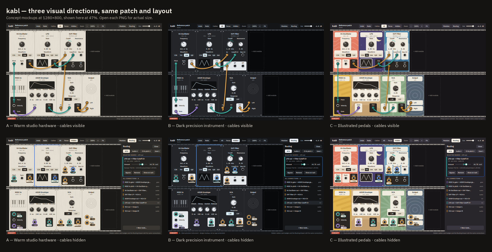
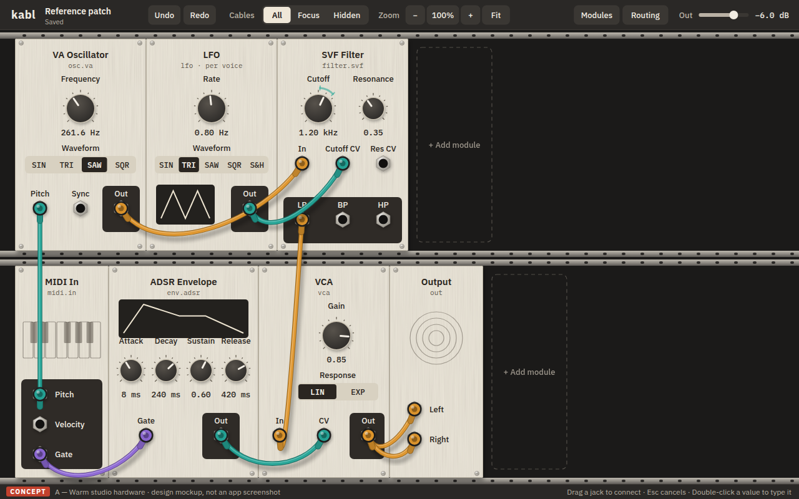
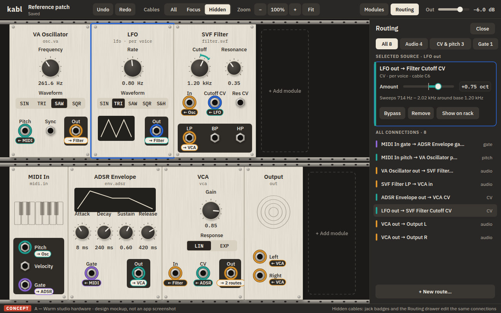
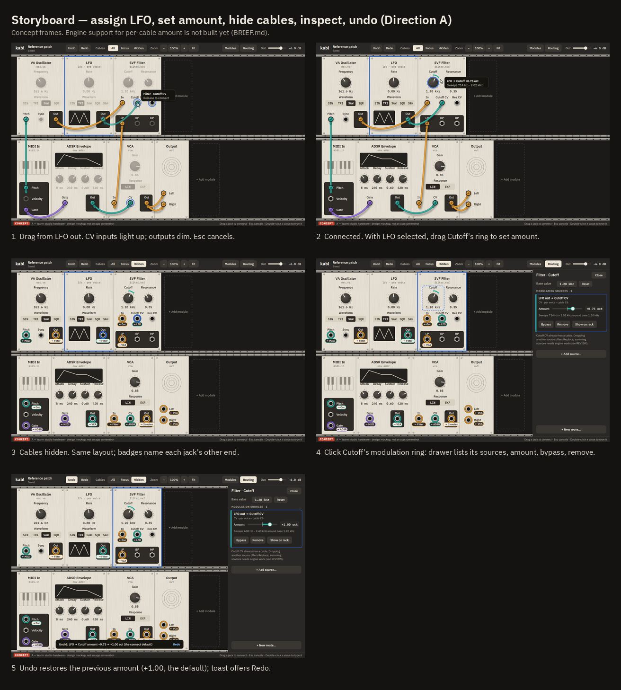

# kabl rack design — review package (P5)

**These are concept mockups, not app screenshots.** Nothing here is built. Every image shows the
same reference patch, with the same layout, values and connections, so the directions differ
only in visual taste.

Full size (1280×800):

| Direction | Cables visible | Cables hidden | Components |
|---|---|---|---|
| **A — Warm studio hardware (recommended)** | [all](directions/a-warm/all.png) | [hidden](directions/a-warm/hidden.png) | [sheet](directions/a-warm/components.png) |
| B — Dark precision instrument | [all](directions/b-dark/all.png) | [hidden](directions/b-dark/hidden.png) | [sheet](directions/b-dark/components.png) |
| C — Illustrated pedals | [all](directions/c-illustrated/all.png) | [hidden](directions/c-illustrated/hidden.png) | [sheet](directions/c-illustrated/components.png) |

## Recommendation: A, warm studio hardware

- **Reads best at a glance.** Dark ink on off-white panels, and outputs on dark plates. The three
  cable colours stand out against both.
- **Looks like hardware without shouting.** Brushed panels, hex-nut jacks, knobs with skirts,
  plugs with strain relief, and cables that sag.
- **Ages well.** Custom module skins can sit on top later without clashing.
- **Risk: it may feel too plain.** C shows the other extreme. A middle path is possible: A's
  panels with C-style art only on skinned modules.
- **Why not B:** the most "pro", and cables stand out most. But its light output plates invert the
  panel logic, and a dark UI tires the eyes over a long session.
- **Why not C:** the most personality. But every control needs a plain plate over the art, which
  makes panels busier and less calm. Its art is still a placeholder. Prompts for real art are in
  [IMAGEGEN_PROMPTS.md](IMAGEGEN_PROMPTS.md).

## How it works: one layout, three cable presentations

- **All:** physical cables in port-type colours: amber = audio, teal = CV/pitch, violet = gate.
  Colour is always backed by text somewhere.
- **Focus:** cables touching the selection stay solid, and the rest fade to 13%
  ([focus.png](directions/a-warm/focus.png)).
- **Hidden:** no cables. Every connected jack gets a ring plus a badge naming its other end.
  The Routing drawer lists every connection, so audio stays editable too. Selecting a source
  (the LFO) lights its destinations' modulation rings, Surge XT-style.

Module positions never change between presentations. The plug, the badge, the drawer row and
the modulation ring are all views of the same cable. There is no separate modulation system.

The storyboard shows: connect LFO to Cutoff CV, set amount +0.75 octave, hide cables, inspect
Cutoff's sources, undo. The full interaction spec, including cancel, undo and keyboard, is in
[INTERACTIONS.md](INTERACTIONS.md).

Stress tests of A:
[crowded, 14 modules / 21 cables](directions/a-warm/crowded-working.png) ·
[crowded, hidden](directions/a-warm/crowded-hidden.png) ·
[50% overview + 100% popover](directions/a-warm/crowded-overview.png) ·
[long names](directions/a-warm/long-names.png) ·
[200% display scale](directions/a-warm/all-200pct.png) ·
[hit regions](directions/a-warm/layout-hit-regions.png)

## QA summary ([QA.md](QA.md))

- **Measured:** 47 hit regions, all at least 28×28, none overlapping. No essential label overlaps
  or overflows. Text contrast is 5.6:1 or better in every direction. Cable and ring indicators
  are 3.4:1 or better, using a two-tone edge.
- **Fixed during inspection:** 10 defects (cables over labels, badge collisions, clipped C
  labels, and others).
- **Known exception:** in All mode, two cables cross the Filter's `LP` label. Focus and Hidden
  solve it.
- **Not provable from pictures:** gesture feel, keyboard, performance, audio, real usability.
  Those need the interactive prototype.

## What it would take to build (later, not authorized)

| Need | Kind |
|---|---|
| Cable rendering, All/Focus/Hidden, badges, drawer, zoom/overview, numeric entry | UI only |
| Per-cable **amount / polarity / bypass** (the Surge-like part) | **engine**: the compiler must read `CableState.params` (it ignores them today) |
| Several sources summed into one input | **engine**: today only the first cable counts, so the UI proposes "Replace" |
| One undo step for repatch / replace / multi-module move | **core**: op grouping |
| Per-input display units ("oct") | small metadata field |
| Live modulated value, output meter, master level | **engine** telemetry / master gain |
| VCA width 6u → 7u | one metadata value |

## Open choices for Kosta

1. **Direction:** A, B, C, or a mix? Which elements feel wrong?
2. **Hidden mode:** is the same layout plus routing drawer what you meant? The alternative is
   for hidden mode to rearrange controls into a compact synth-style layout. That shows more per
   screen, but you lose "same place every time", and the design needs a second layout.
3. **Size and next step:** do 1280×800 and this density feel comfortable on your display? May
   work proceed to an isolated interactive prototype of the chosen design?

Source for every image: [`render.py`](render.py). Run `python3 docs/design/render.py` to
regenerate it, or `--qa` for measurements. The brief is in [BRIEF.md](BRIEF.md).
