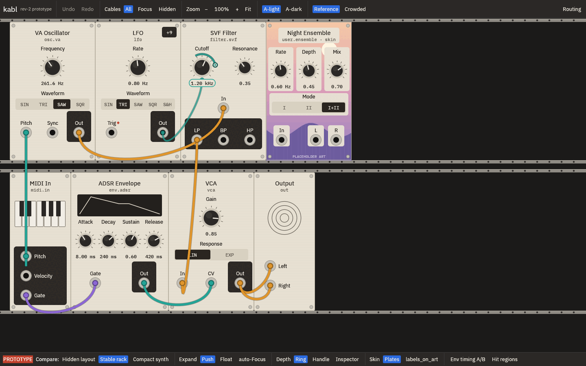
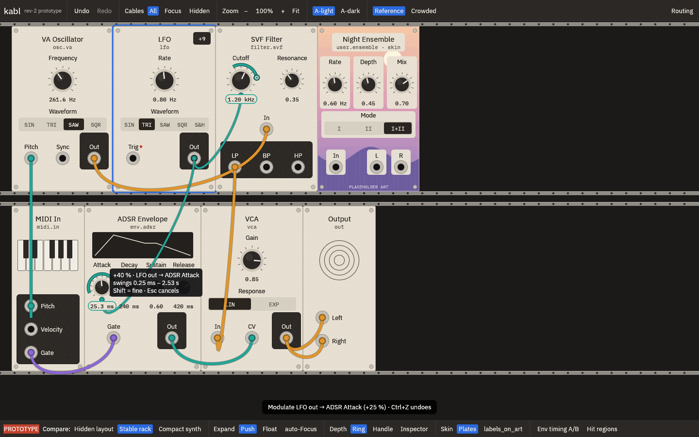
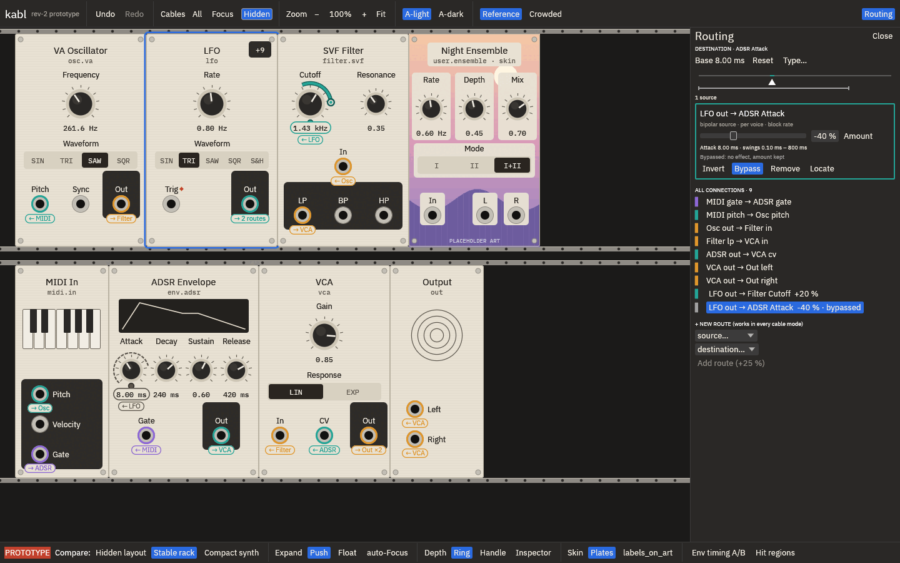
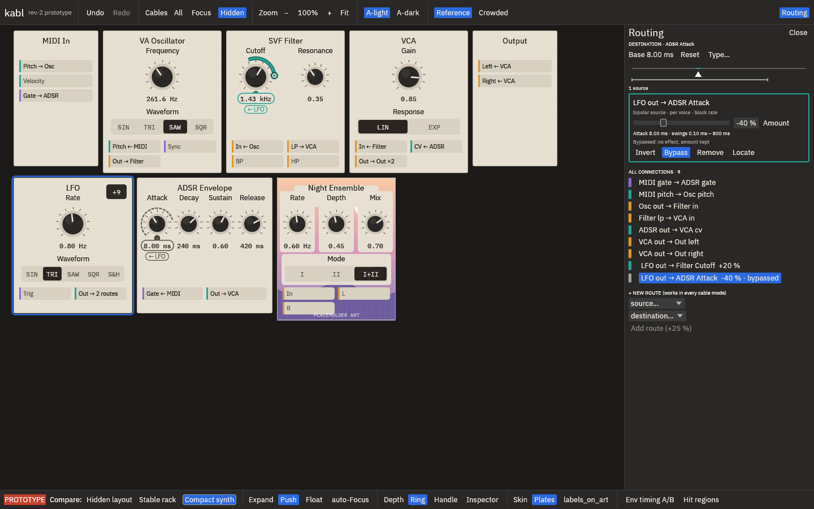
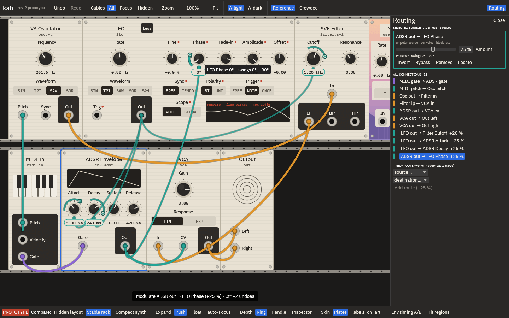
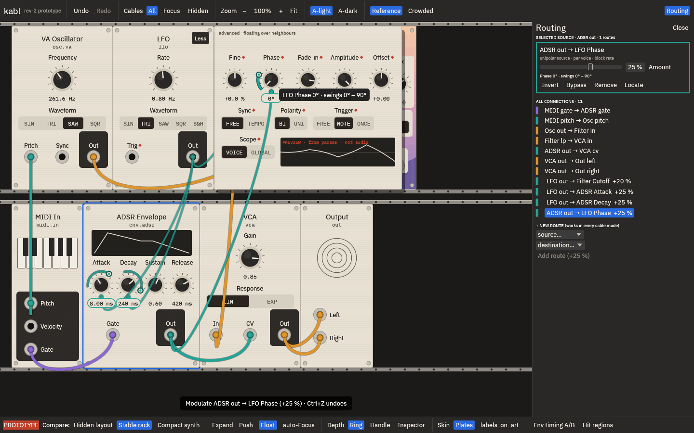
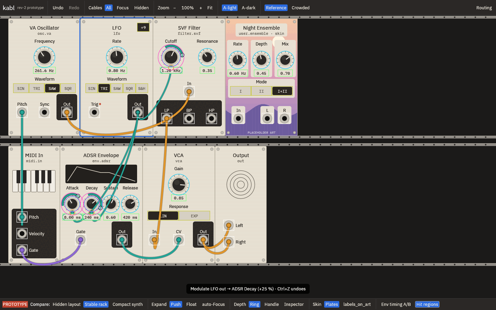
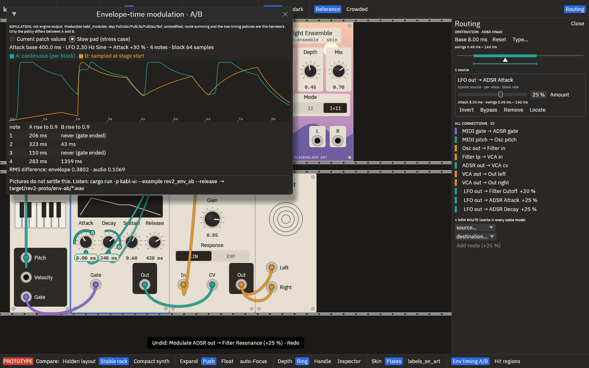
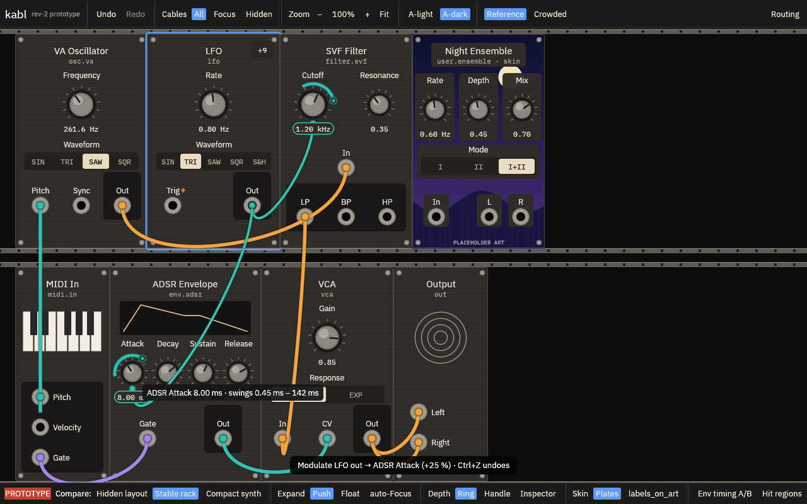
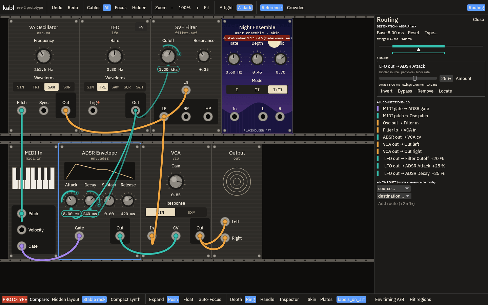

# Revision-2 interactive prototype

An isolated, hands-on prototype of the accepted revision-2 design. It exists so Kosta can **use**
the design and settle the four open questions. It is not production code.

- Code: `crates/ui/examples/rev2_proto/` (an example target of `kabl-ui`) and
  `crates/ui/examples/rev2_env_ab.rs`.
- It does not change `kabl-ui`, the engine, the patch format, or any existing behaviour.
- It opens no audio device, no MIDI port and no patch file. The patch lives in memory only.
- **Mock signals:** the LFO output preview and the ADSR shape display are drawings computed
  from the knob values. They are not audio or telemetry, and the LFO preview says so on screen.

## Launch

```sh
cargo run -p kabl-ui --example rev2_proto --release                          # 1440×900, A-light
cargo run -p kabl-ui --example rev2_proto --release -- --dark                # start in A-dark
cargo run -p kabl-ui --example rev2_proto --release -- --size 1280x800       # minimum viewport
cargo run -p kabl-ui --example rev2_env_ab --release                         # envelope A/B WAVs
```

The WAV files are written to `target/rev2-proto/env-ab/`. The prototype uses IBM Plex and
DejaVu fonts from `/usr/share/fonts` when they are present, else egui's own fonts (in that case,
arrows render as boxes).

## Controls

| Do | How |
|---|---|
| Change a knob | Drag vertically on the knob. **Shift** = fine (×0.1). **Esc** or right-click during a drag cancels it |
| Type a value | Double-click the value or the knob. Accepts `12 ms`, `2 s`, `1.2k`, `800 Hz`, `0.35`. Enter commits, Esc cancels |
| Selector | Click a segment |
| Connect a cable | Drag from a jack to a jack. Dragging from a patched input picks up the cable end |
| Modulate a knob | Drag from an output jack onto **any** knob: +25 %. Alt-release: +0 % |
| Route depth | Depends on the **Depth** comparison switch (below). Also the route card's slider (click its number to type) |
| Route amount by typing | Double-click a knob's plug (the dot at 6 o'clock) |
| Invert / Bypass / Remove | Route card in the Routing drawer, or right-click a plug. Dragging a plug off a knob into empty space removes the route |
| Inspect a destination | Click a modulated knob, its ring or its plug. The drawer shows the base, a range bar and one card per source |
| Expand / collapse | The `+N` / `Less` button in the module header |
| Choose primary controls | Right-click a module → `Choose primary controls…`, click pins, then `Done`. Or right-click a control → `Pin to face` / `Remove from face` |
| Undo / redo | Toolbar, **Ctrl+Z**, **Ctrl+Shift+Z** / **Ctrl+Y**. Every patch edit is one step; view switches are not undoable |
| Pan / zoom | Drag empty rack, scroll wheel, Ctrl+wheel; toolbar − / 100 % / + / Fit |
| Cables | Toolbar All / Focus / Hidden. Focus follows the selected module |
| Theme | Toolbar A-light / A-dark |
| Patch | Toolbar Reference / Crowded (14 modules, 13 cables, 11 routes). Loading is undoable |
| New route without a cable | Routing drawer → `+ New route`. Works in every cable mode and lists hidden controls |

## Comparison switches (bottom bar)

All switches change only the view. Patch values, selection and inspection are preserved when you
switch; the scripted runs check this (`expect same`).

| Question | Switch | Variants |
|---|---|---|
| 1. Hidden-mode layout | **Hidden layout** (active when Cables = Hidden) | `Stable rack`: the same rack, with badges instead of cables. `Compact synth`: modules re-flow in signal order (MIDI, Osc, Filter, VCA, Out, then modulators), without rack rails or decor; jacks become chips such as `In ← Osc`, which you can still drag to patch |
| 2. Expansion vs neighbours | **Expand** `Push` / `Float`, plus `auto-Focus` | Push: the advanced area is appended and the rest of the row moves right. Float: the advanced area overlays the neighbours with a shadow; nothing moves. auto-Focus: while a module is expanded, All becomes Focus on it |
| 3. Small-knob depth gesture | **Depth** `Ring` / `Handle` / `Inspector` | Ring (the spec): drag the outer band for depth, the knob body for base. Handle: only a white handle at the peak dot drags depth; the whole knob area drags base. Inspector: no depth gesture on the knob; use the route card or type the amount |
| 4. Envelope-time modulation | **Env timing A/B** | A window with matched plots and per-note numbers; listen to the WAVs |
| Skin flag | **Skin** `Plates` / `labels_on_art` | The placeholder-art user module, `Night Ensemble` |
| Debug | **Hit regions** | Draws the real hit regions over the controls |

## Walkthrough (10 minutes)

1. **LFO → Attack.** Drag from LFO `Out` to the ADSR **Attack** knob. The ring, peak dot, pill
   and plug appear. The toast says `+25 %`.
2. **Base vs depth.** Drag the Attack knob body: the base changes, the depth stays. Drag the
   ring band (Depth = Ring): the depth changes, the base stays. Try the same with Depth = Handle
   and Depth = Inspector. The knob is small (r 17), and Decay sits 56 px away. **This is question 3.**
3. **Route card.** Invert, then Bypass. The lead goes grey and dashed, the ring goes hollow, and
   the drawer row says `bypassed`.
4. **Hide cables.** Cables = Hidden. Compare `Stable rack` with `Compact synth`. Do the same small
   task in both: type a new Cutoff, then bypass a route. **This is question 1.**
5. **Several sources.** Drag MIDI `Velocity` onto Attack as well, then click Attack. The inspector
   lanes show each source.
6. **Collapse a modulated control.** Expand the LFO, drop ADSR `Out` on **Amplitude**, then
   collapse. The route docks on `+9` with a ring (in Hidden mode: `◆ 1 hidden`). Hover it.
   Click it: the module expands and the control flashes.
7. **Primary controls.** Right-click the LFO → Choose primary controls. Pin Amplitude and Offset
   (the face grows to 8u), then Done. Undo each step.
8. **Expansion.** Expand the LFO with `Push`, then with `Float`, with auto-Focus on and off.
   Adjust an advanced knob and patch into it in both. **This is question 2.**
9. **Envelope timing.** Open Env timing A/B. Then run `rev2_env_ab` and listen to each A/B pair.
   **This is question 4.**
10. Repeat anything at `--size 1280x800`, in A-dark, and on the Crowded patch.

## Evidence

All numbers below come from the running prototype, not from the mockup geometry.

**Scripted interaction runs.** `crates/ui/examples/rev2_proto/scripts/{walkthrough,variants}.txt`
drive the prototype through injected egui pointer and key events, so egui's hit-testing,
gesture and widget code all run. Each run checks the resulting state and saves framebuffer
screenshots. They ran under Xvfb with Mesa llvmpipe, at pixels-per-point 1:

```sh
Xvfb :97 -screen 0 1600x1000x24 &
DISPLAY=:97 cargo run -p kabl-ui --example rev2_proto --release -- \
  --script crates/ui/examples/rev2_proto/scripts/walkthrough.txt --shots target/rev2-proto/shots --ppp 1
```

| Run | Checks |
|---|---|
| walkthrough, 1440×900 A-light | 41 pass, 0 fail |
| walkthrough, 1280×800 A-dark | 41 pass, 0 fail |
| variants, 1440×900 A-light | 39 pass, 0 fail |
| variants, 1280×800 A-dark | 39 pass, 0 fail |

The walkthrough covers these tasks: connect LFO → Attack; adjust the base separately from the
depth; numeric entry of base and amount; fine drag; invert; bypass; hide cables in both
layouts (patch and selection preserved); several sources on one knob, inspected; collapse a
modulated control; promote primary controls through the context menu and pins; undo and redo;
Esc-cancel of a knob drag and of a cable drag; theme switch; zoom and pan; removing a route and
undoing the removal. The variants run repeats identical tasks in every comparison variant.

**Real X input.** A separate pass drove the release binary with `xdotool`: real X pointer
events went through winit. The pass dropped LFO Out on Attack (+25 %), dragged the ring to
+40 % (the tooltip showed the clamp) and pressed Ctrl+Z, which returned the route to +25 %.

**Unit tests.** `cargo test -p kabl-ui --example rev2_proto` passes 7 tests. They check parsing,
the storyboard numbers (8 ms at +25 % swings 0.45–142 ms), undo round-trips, that every hit
region is reachable at its own centre in all three depth modes, that controls do not overlap
in the expanded LFO, and that the envelope renders are deterministic and differ only by policy.

**Q3, hit regions against drawn geometry** (`probe`, which samples the drawn cap and the drawn
range arc at r + 11 ± 2 px). Attack and Decay are both modulated, 56 px apart:

| Variant | Knob | Cap points → own knob | Drawn arc points → |
|---|---|---|---|
| Ring | Attack r 17 | 216 / 216 | own ring 100 % |
| Ring | Decay r 17 | 216 / 216 | own ring 100 % |
| Ring | Cutoff r 22 | 216 / 216 | own ring 100 % |
| Handle | Attack, Decay r 17 | 216 / 216 | handle 14 %, inert panel 86 % |
| Inspector | Attack r 17 | 216 / 216 | inert panel 100 % |

Regions: body r + 4 when routed (r + 8 otherwise); ring band r + 4 … r + 15; plug r 7 at 6 o'clock;
handle r 9. Where two ring bands overlap, the nearer knob centre wins. So in scripted geometry
the ring/body split does not misfire at r 17. **Gesture feel with a real hand is not measured.**
That is what Kosta should judge.

**Q2.** With Push, expanding the LFO moves the filter from x 444 to x 834 (+13u). With Float, the
filter stays at x 444 and the advanced area covers the filter and the skin module.

**Q4, offline A/B** (`rev2_env_ab`; A = continuous per 64-sample block, B = sampled at note-on):

| Scenario | RMS diff, env / audio | Rise to 0.9 per note, A (ms) | B (ms) |
|---|---|---|---|
| Reference patch: Attack 8 ms, LFO 0.8 Hz TRI, +25 % | 0.061 / 0.017 | 86 1 84 6 6 66 1 85 | 130 1 59 7 6 91 1 59 |
| Same, +50 % | 0.152 / 0.042 | 158 0 – 5 3 139 0 – | – 0 264 5 3 – 0 270 |
| Slow pad: Attack 400 ms, LFO 2.3 Hz SIN, +30 % | 0.380 / 0.107 | 206 323 110 283 | – 43 – 1359 |

`–` means the note ended before the envelope reached 0.9. The policies clearly differ. Under B,
a note that catches a long latched attack may never open. Under A, the attack wobbles with the
LFO. **Which one sounds right is not settled by these numbers.** This is a simulation: it uses
the production `FullAdsr`/`FullLfo`/`FullOsc`/`Svf` unmodified, but the harness does the route
summing and the policy. The engine has no knob routes yet.

**Found and fixed while verifying** (all found in real screenshots or scripted runs):

- A double-click within 0.6 s of an earlier click registered as a triple-click, so numeric
  entry silently failed.
- Neighbour value pills were drawn over the floating advanced area.
- Hidden-mode knob badges collided with selector labels in the compact layout. Badges now move
  beside the pill when below is blocked.
- Advanced selectors were too narrow for `TEMPO` / `GLOBAL`.
- Pins overlapped labels in choose mode.
- The plug overlapped the bottom of the cap by 1 px, and a 1 px dead band separated the body
  from the ring.
- The `labels_on_art` contrast check ignored the moon and hills in the art. It now samples every
  label and value box: 2.8:1 (light) and 1.1:1 (dark, `Mix` over the moon), so the [rec] loader
  warning appears. With plates, the problem does not arise.
- Knob values collided at 56 px spacing, and the ADSR face was 9u instead of 8u.
- Ctrl+Shift+Z was read as undo.
- Arrows rendered as boxes with egui's bundled fonts.

Screenshots (real, from the runs above): [`prototype/img/`](prototype/img/).












## Known limitations

- No engine, no audio in the app, and no MIDI. Knob values do not make sound. The envelope A/B
  is offline only.
- Modules cannot be added, removed or dragged to new positions. Module order is fixed.
- Plugs on selectors are drawn but cannot be hit (only knob plugs). The 4th and later routes
  share the 3rd plug position, labelled `+N`, and cannot be grabbed one by one.
- There is no keyboard focus navigation beyond Esc, Enter and undo/redo. The x-ray fade of
  cables over hovered controls is not implemented.
- Tooltips can cover nearby values. In the compact layout, when neither side of the pill is
  free, a badge can still overlap a label (seen on the skin module's `Mode` in the crowded
  patch).
- auto-Focus follows the first expanded module.
- The skin art is a procedural placeholder. The contrast warning is measured against it.
- The screenshots and scripted runs come from Xvfb with software GL at pixels-per-point 1. None
  of this has been seen on Kosta's display or at his scale factor.
- The route card labels `per voice` and `block rate` follow the design rules. Nothing computes
  them.
