# kabl rack design — revision 2 review package

**Concept mockups, not app screenshots.** Nothing is built. This round answers the owner's G1
questions: modulating ADSR Attack from the LFO, a full-featured LFO, A-dark, and illustrated
skins. Revision 1 ([`../REVIEW.md`](../REVIEW.md)) is unchanged, and its images re-render
byte-identical.

The spec is in [INTERACTIONS.md](INTERACTIONS.md). Each rule there is tagged **[owner]**
(decided at G1), **[rec]** (agent proposal, not approved) or **[open]**. Everything new in this
package is a proposal.

## 1. Reference patch, A-light and A-dark (1440×900)

LFO → Filter Cutoff and LFO → ADSR Attack now land on the **knobs**. The filter's Cutoff CV and
Res CV jacks are gone from the panel.

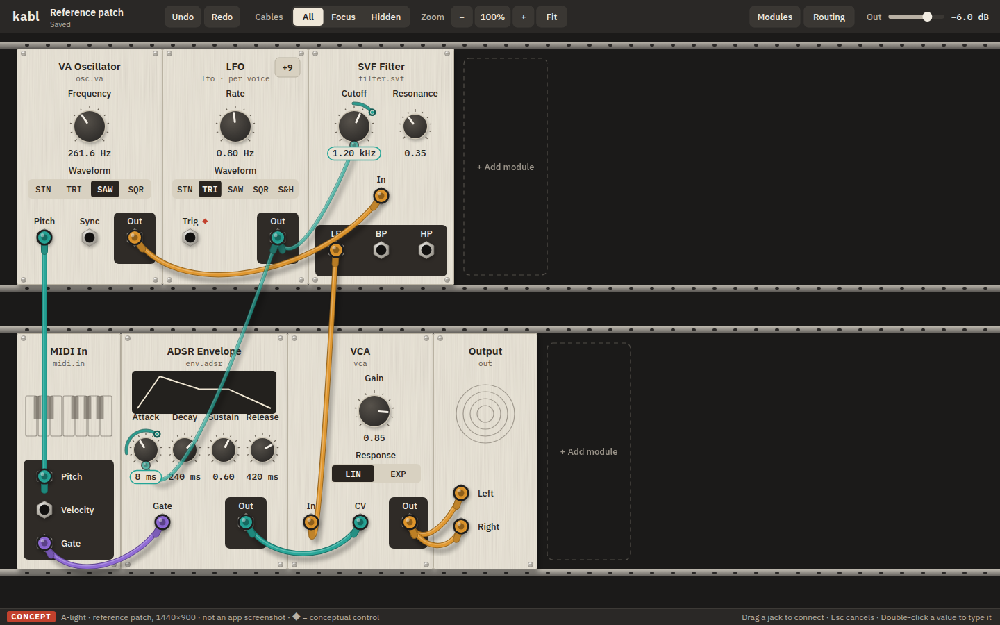
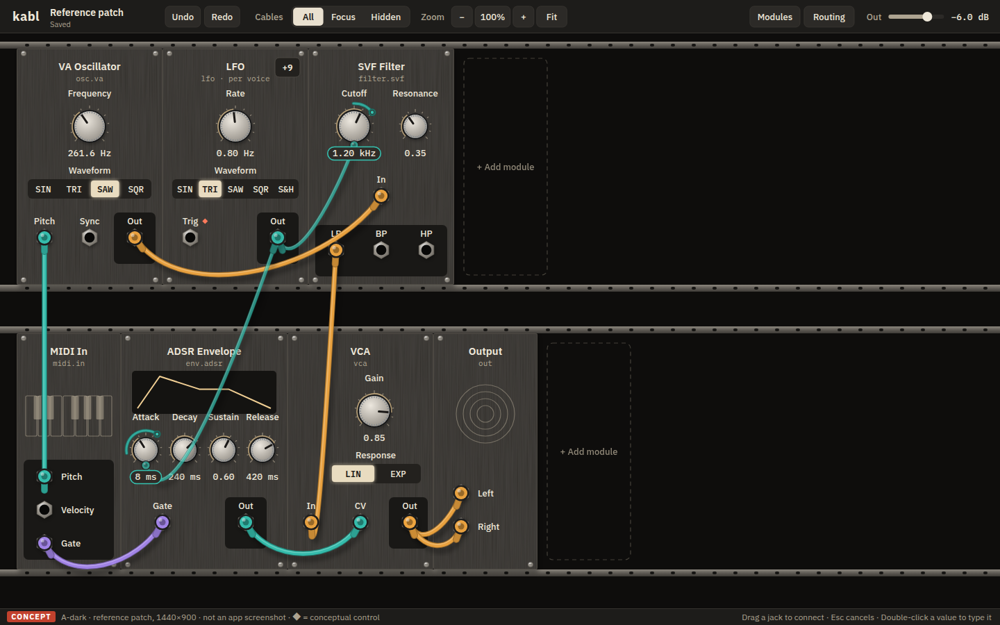
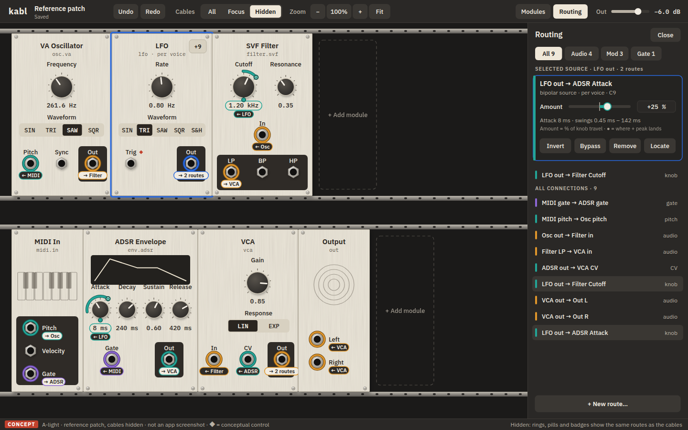
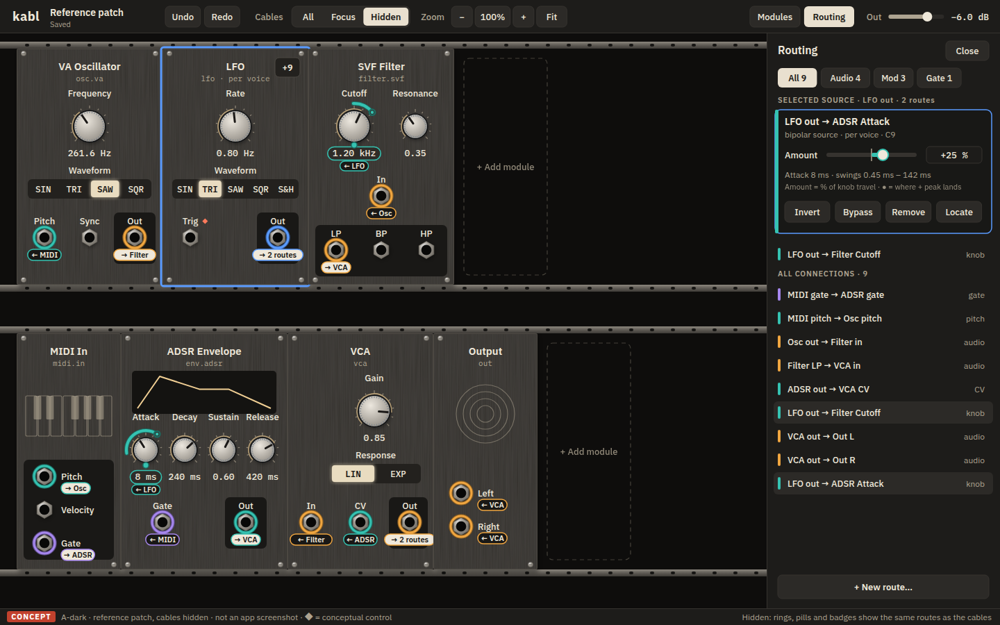

- **A-dark** keeps A's layout, type and warmth: a graphite panel with brushed texture. It takes
  B's material: knurled light-metal caps and a restrained glow on the selected segment, the
  value track and a strong mod ring. Output plates are *darker* than the panel, so the "outputs
  on a plate" logic holds without B's inverted light plates.
- **Modulated knob:** the pointer is the **base**. The pill holds the base value. The outer
  ring is the **resulting range**. The dot on the ring is where the source's + peak lands, which
  shows polarity. The plug docks at 6 o'clock. Knob routes are drawn as thinner, slightly
  translucent "mod leads". The value pill sits above cables.
- **Hidden:** the same layout. A modulated knob keeps its ring and pill and gains a `← LFO`
  badge. LFO Out reads `→ 2 routes`.

## 2. Storyboard: LFO → ADSR Attack

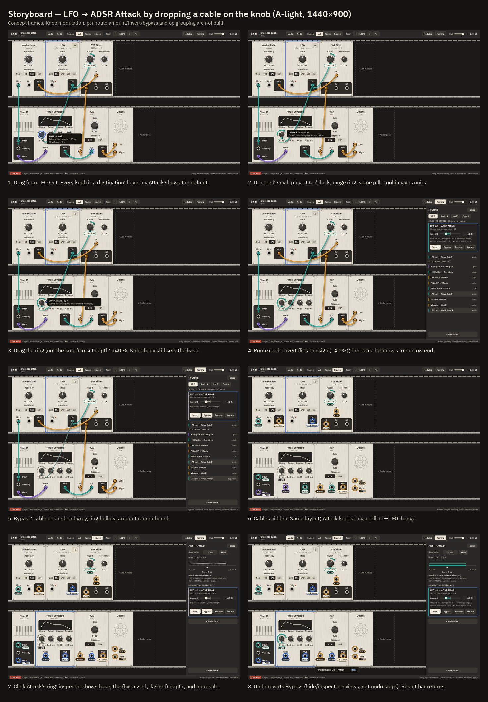

Drop on the knob (+25 % default), drag the **ring** for depth (+40 %), Invert (−40 %), Bypass,
hide cables, inspect, Undo. The inspector's range bar separates the three quantities: ▲ base,
thin bracket = depth per source, thick bar = result. Full-size frames:
[1](img/story-1.png) · [2](img/story-2.png) · [3](img/story-3.png) · [4](img/story-4.png) ·
[5](img/story-5.png) · [6](img/story-6.png) · [7](img/story-7.png) · [8](img/story-8.png).

## 3. Rich LFO

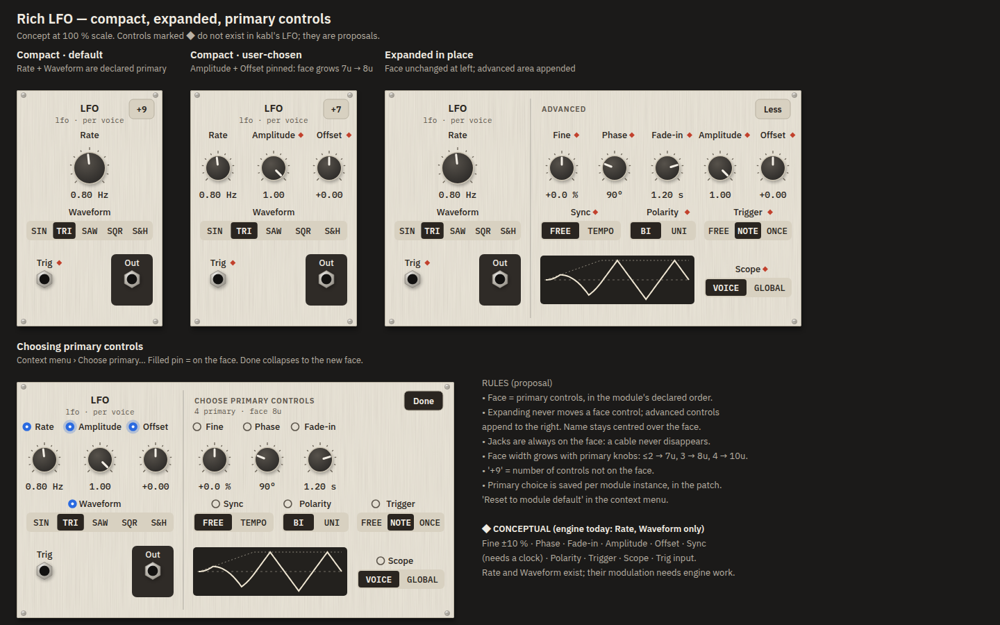

- **Compact** = the primary controls only (default: Rate, Waveform). **Expanded** appends an
  advanced area to the right. Face controls never move. The `+9` button shows how many controls
  are hidden.
- **Primary choice:** pins in expanded mode. Pinning Amplitude + Offset grows the face from 7u
  to 8u (`+7`).
- **◆ = conceptual.** kabl's LFO has only Rate and Waveform today. Fine, Phase, Fade-in,
  Amplitude, Offset, Sync (needs a clock), Polarity, Trigger, Scope and the Trig input are
  proposals.

What expansion does to its neighbours:

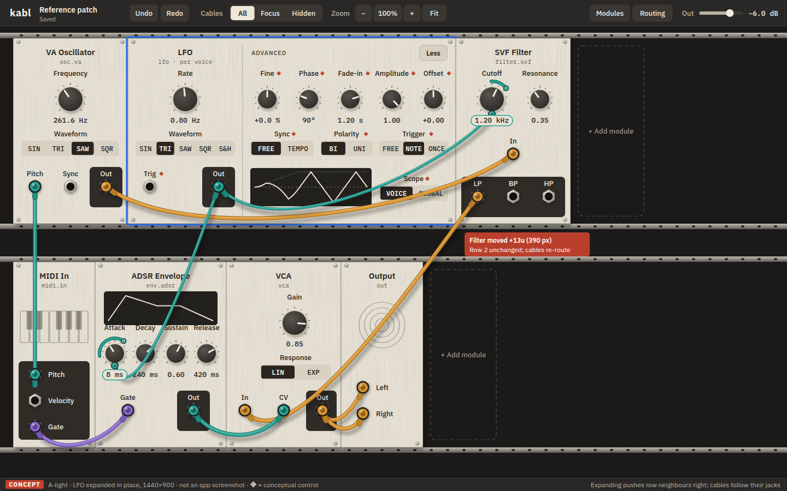
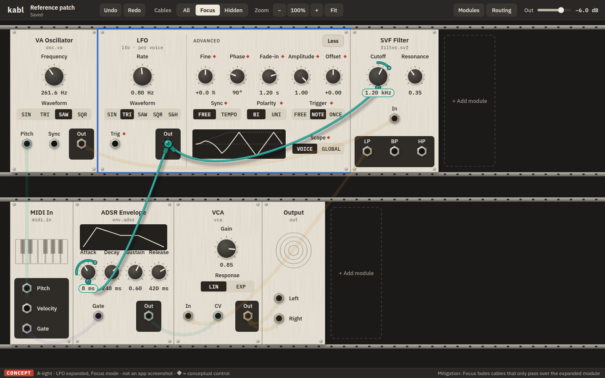

The filter moves right by 13u, and cables follow their jacks. **Problem found:** long cables
that pass the expanded module now cross its advanced area (Osc → Filter crosses Scope; Filter
LP → VCA crosses row 2). Focus is the mitigation shown here. See open decision 2.

## 4. Difficult cases

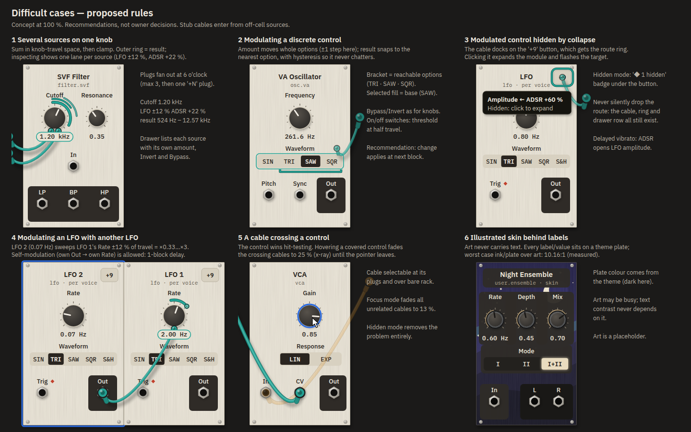

Several sources on one knob (sum, then clamp; lanes appear when inspected) · discrete control
(moves by whole options, snaps, hysteresis) · a modulated control hidden by collapse (docks on
`+9`) · LFO modulating an LFO (with feedback allowed at 1-block delay) · a cable over a control
(the control wins; x-ray fade to 25 %) · skin behind labels (theme plates).

Rules for units, ranges, combining sources, limits and voice/global behaviour are in
[INTERACTIONS.md §2](INTERACTIONS.md#2-modulation-model). In short, the amount is a % of knob
travel, and the UI also shows it in destination units.

## 5. Illustrated user module, light and dark

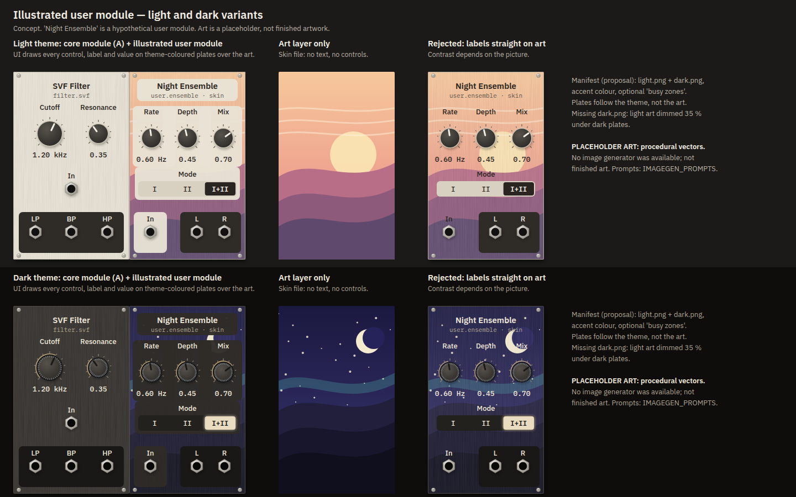

**The art is a procedural PLACEHOLDER.** No image generator was available in this session.
This is not finished art. The sheet shows the rule: the skin supplies art only. The UI draws
every control, label and value on **theme-coloured** plates. The "rejected" column shows labels
placed straight on the art. The prompts for real art are in
[`../IMAGEGEN_PROMPTS.md`](../IMAGEGEN_PROMPTS.md); they need a light/dark pair added.

## 6. Minimum window and crowding

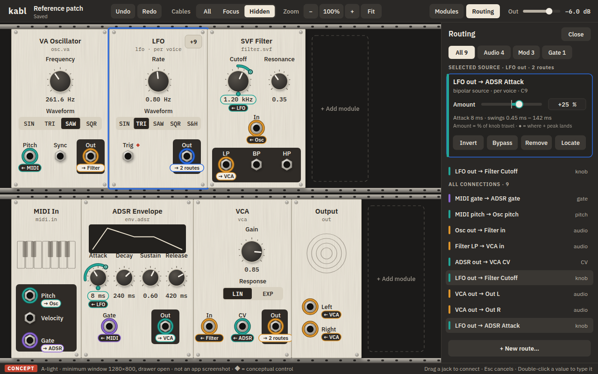
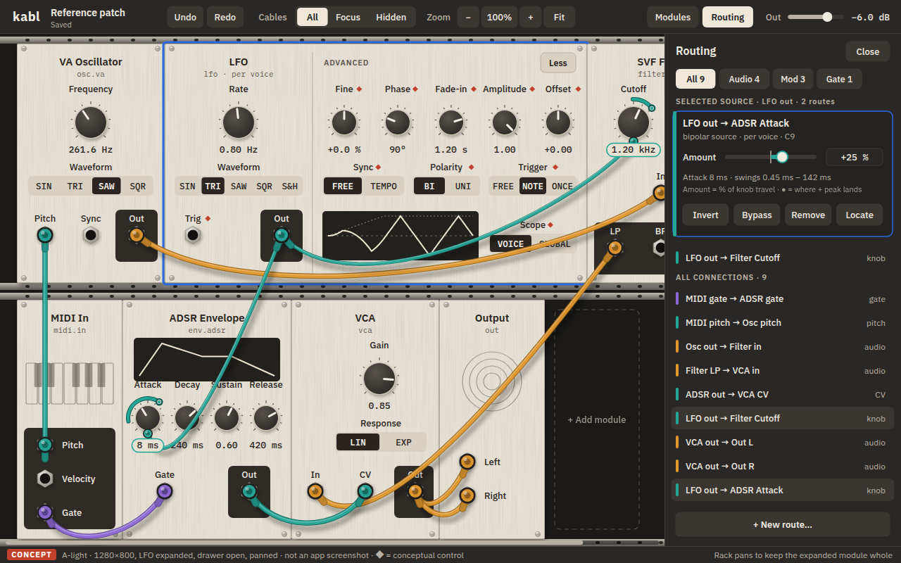
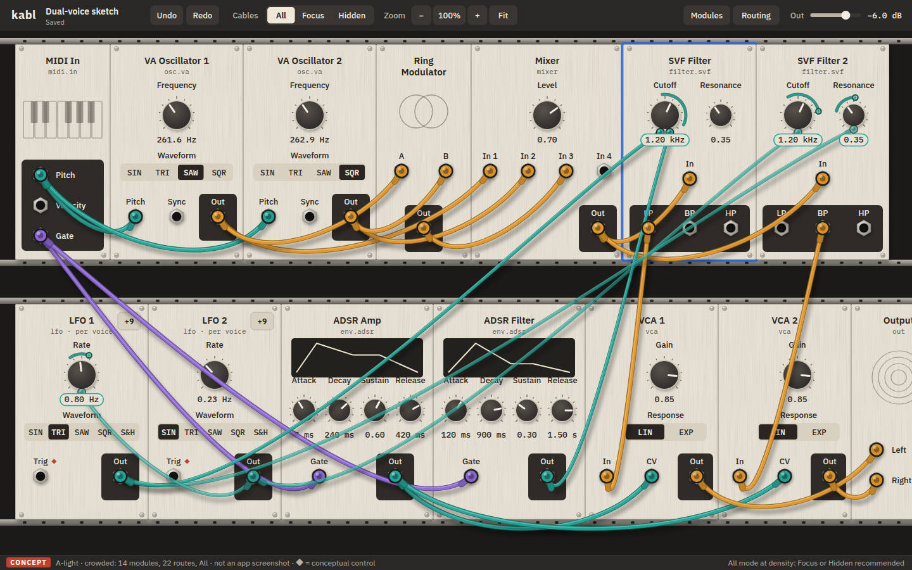
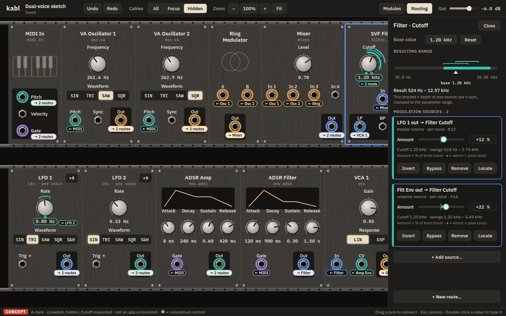

At 1280×800 with the drawer open, the rack has 944 px. The expanded LFO (600 px) fits, and the
filter pans under the drawer (scrollbar). Crowded All mode (14 modules, 22 routes) is a tangle,
as expected. Hidden mode stays legible, and the destination inspector lists both sources.

## 7. Open decisions for Kosta

1. **Expanded modules + user-chosen primary controls.** Do these feel right? Specifically:
   face-stays-put with the advanced area appended to the right; the face widening with more
   primary knobs; pins as the selection UI.
2. **Expansion vs neighbours.** Push the neighbours right (shown), or float the expansion over
   them? Should expanding auto-switch to Focus? Recommended: push + manual Focus, then decide
   in the prototype.
3. **Knob modulation clarity.** Does it read with cables visible (plug at 6 o'clock, mod lead,
   ring, pill) and with cables hidden (ring, pill, badge)?
4. **Ring vs knob-body drag** for depth vs base. It is unproven at small radius (r 17). It needs
   the prototype.
5. **Envelope-time modulation:** continuous (recommended) vs sampled at stage start. Choose by
   ear.
6. **Default drop amount** +25 % (recommended) vs 0 %.
7. **Hidden-mode layout** (stable rack vs compact synth layout). It remains open, as agreed;
   this round uses the stable rack.
8. **Viewport:** 1440×900 proposed as the default. 1280×800 stays the minimum.

## 8. QA — measured / inspected / unverified

Run `python3 docs/design/revision-2/render2.py --qa`.

**Measured** (from the same geometry the images are drawn from):

| Check | Result |
|---|---|
| Hit regions (reference / LFO expanded / choose mode / custom face / crowded) | 47 / 61 / 72 / 49 / 98. All ≥ 28×28. **0 overlapping pairs**, except the `+N`/`Less` button inside the header drag zone, which is nested by design and wins |
| Essential text overlap / panel overflow | 0 findings in all five layouts |
| A-dark text contrast | lowest 5.9:1 (module kind line). Panel labels 11.4:1, plate labels 14.6:1, chrome secondary 6.8:1 |
| A-dark non-text | CV/mod ring 6.3:1, gate 4.8:1, audio 6.8:1 (two-tone best vs panel). Selection 5.0:1 |
| A-light | unchanged from revision 1. The new mod ring (two-tone) is 6.1:1 |
| Skin plates | ink on a 96 % theme plate over the extreme placeholder-art colours: worst **11.1:1** light, **10.2:1** dark. Real art must be re-measured |
| Cable obstruction, reference patch, All mode | 5 crossings: C3 over `LP`; C4 over VCA `In`; the LFO → Attack mod lead over the Decay knob, `240 ms` and `Sustain`. Revision 1 had 2 (LP) |
| Cable obstruction, crowded, All mode | 25 crossings. Hidden: 0 by construction |
| 1280×800 with drawer | 944 px rack. The expanded LFO fits without a pan |
| Storyboard / drawer numbers | computed from param tapers (for example +25 % → 0.45–142 ms; +40 % clamps at 0.1 ms, → 800 ms) |

**Inspected** at actual size, with defects fixed during this round: expanded width was
ignored (render hook); knob badges collided with the `Waveform` label (now collision-checked
placement); the inspector's base label overlapped the scale end; stub cables and tooltips
covered notes; skin art bled outside the panel (missing clip); the storyboard's +40 % range
was wrong (now computed); the "output" caption overlapped the LFO preview trace; the
conceptual marks crowded the pins in choose mode.

**Unverified (static pictures cannot show these):** gesture feel for ring vs body drag, drop
accuracy onto small knobs, readability of translucent mod leads in motion, the feel of
expansion reflow, keyboard flow, runtime performance, and sound (modulation smoothness, block
rate). The A-dark palette was judged on this screen only. It has not been checked on the
owner's display.

## 9. What it would take (later, not authorized)

| Need | Kind |
|---|---|
| Knob routes: compiler applies route amount/sign/bypass into the param `Signal`; sum, then clamp | **engine** |
| Several routes per destination; summing on jack inputs | **engine** |
| LFO features marked ◆; Sync needs a clock | **engine / modules** |
| Per-instance primary set + expanded state in the patch; one undo op per choice | **core** |
| Op grouping (repatch, replace, multi-move) | **core** |
| Mod leads, rings, pills, badges, inspector, expansion reflow | UI |

Prerequisite before any playable integration: MIDI, graph-swap and undo correctness (STATUS).

Sources: [`render2.py`](render2.py) (`python3 docs/design/revision-2/render2.py` regenerates
every image in `img/`).
