# Interlocking sequences: transport, clock divider, transpose

**Status: built and verified, waiting for Kosta's review.** Scope came through the supervisor:
two interlocking sequences playable from one shared clock. Rationale:
`decisions.md`, "Interlocking sequences: transport, clock divider, transpose".

    cargo run --release -p kabl-ui -- --patch patches/interlocking                # 1440×900
    cargo run --release -p kabl-ui -- --patch patches/interlocking --size 1280x800

## What is new

- **Clock transport.** The clock face has **Stop/Run** and **Restart** buttons under the BPM
  knob. The dot on Stop means running. These are runtime commands to the audio thread, never
  patch edits: undo, redo, reload and graph swaps cannot replay them. A patch still starts
  playing when it loads.
  - **Stop** takes `gate` low at once, so connected envelopes release.
  - **Run** starts a full-width pulse on the next sample. That pulse is the next step: the
    pulse Stop cut short was already counted, so no step is played twice or skipped.
  - **Restart** while running starts a pulse at once (after one low sample if `gate` was high)
    and raises the new **`reset` output** for that pulse. While stopped, it arms that reset for
    the next Run.
  - Nothing is reset behind the scenes. A sequencer or divider goes back to step 1 only if
    `clock.reset` is patched to its `reset` input.
- **Divider (`clock.div`).** `clock` and `reset` in, `gate` out, *Divide by* 1–8. It passes
  every Nth pulse at the pulse's own width. The first pulse after a reset passes. A new
  division takes effect on the next rising edge, which passes and restarts the count, so a
  pulse is never cut or added.
- **Sequencer transpose.** An advanced control next to *Length* (click `+2`): −24..+24 st in
  whole semitones, default 0, so existing patches sound the same. Editing it never restarts
  the pattern. The face choice can pin it to the face, like any advanced control.
- **Pitch text.** The module panel's sliders printed raw floats ("16.0", or "6.6" for a note
  that plays +7). They now read like the knobs ("+16 st"). Knob labels no longer print
  "-0 st". Stored values are never rewritten for display.
- **BPM changes and unrelated live edits keep the musical position.** The clock phase, the
  divider count and the sequencer steps carry across every graph swap.

## The demo: `patches/interlocking`

116 bpm. One clock drives both lines:

- **Bass** (row 1, `seq #3`): every 16th, 7 steps, E minor pentatonic around E2 (transpose
  −24). A saw into a resonant low-pass. A short envelope drives both the VCA and the cutoff,
  and a slow triangle LFO (0.08 Hz) sweeps the cutoff.
- **Lead** (row 2, `seq #4`): every 8th through the divider (/2), 5 steps (E4 G4 B4 A4 D5,
  step 4 a rest). A square into a brighter filter with a longer tail. The same LFO moves its
  cutoff the other way.
- The 7-step 16ths and 5-step 8ths meet again every 70 sixteenths (about 9 s), so the lines
  shift against each other.
- `clock.reset` is patched to the divider and to both sequencers' `reset` inputs.
- Mixer `Level 1` (bass) 0.22 and `Level 2` (lead) 0.12 bring each layer in and out.
- **Headroom** (engine test, 20 s, 8 voices): peak −7.3 dBFS, RMS −18.7 dBFS. Bass alone
  −21.4 dBFS RMS, lead alone −22.2. The walkthrough's recorded left channel peaks at −7.3 dBFS.

## Walkthrough video

[`walkthrough.mp4`](walkthrough.mp4) (88 s, 1440×900 scaled to 1280, real app audio from the
release build). It was recorded by `record-walkthrough.sh`, which drives the app with
`scripts/walkthrough.txt`. Times are approximate (±0.5 s):

| t (s) | action |
|---|---|
| 0–6 | both lines playing |
| 6 / 11 | lead out (*Level 2* to 0), back (ctrl+z) |
| 16 / 21 | bass out (*Level 1* to 0), back (ctrl+z) |
| 26 | bass step 2 edited live (+16 → +9 st) |
| 32 | lead step 4 rest switched on |
| 38 / 44 | lead transpose +5 st (advanced area), back (ctrl+z) |
| 50 / 55 | tempo 116 → 131 bpm, back (ctrl+z) |
| 60 | **Stop**: the notes release into silence |
| 64 | **Run**: continues on the next step |
| 70 | **Restart** while running: both lines on step 1 together |
| 75 / 79 / 82 | **Stop**, **Restart** while stopped (armed, silent), **Run**: starts on step 1 |

In the recording, the Restart at about 70 s landed while the bass was already on its step 1,
so it shows on the lead. Step lights, one row per frame at 30 fps (bass left, lead right):
the lead jumps from P2 back to P1 at 70.03 s, and then both count on together.

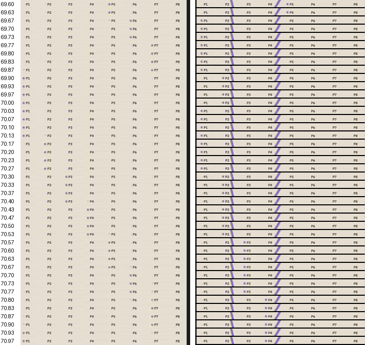

## Screenshots (real app, release build, Xvfb)

Taken by `scripts/shots.txt` through `docs/rack-migration/drive.py`. Fit zoom is 56 % at
1440×900 and 50 % at 1280×800, because the patch has four rows. The transport buttons are
drawn at the same scale as every other face control. *Focus* on the clock, or the zoom
buttons, bring them to 100 %.

| | 1440×900 | 1280×800 |
|---|---|---|
| A-light | 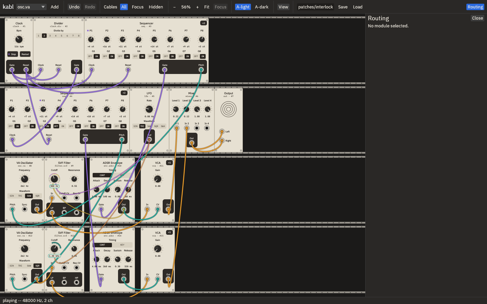 | 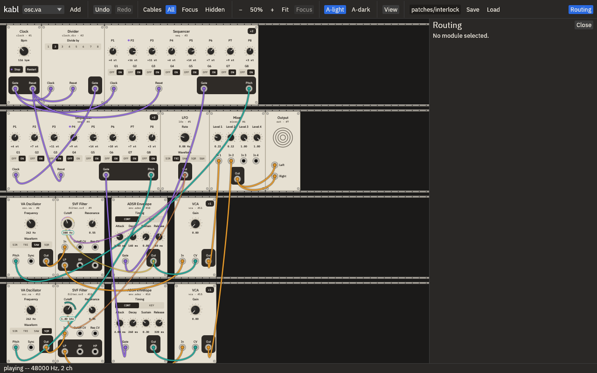 |
| A-dark | 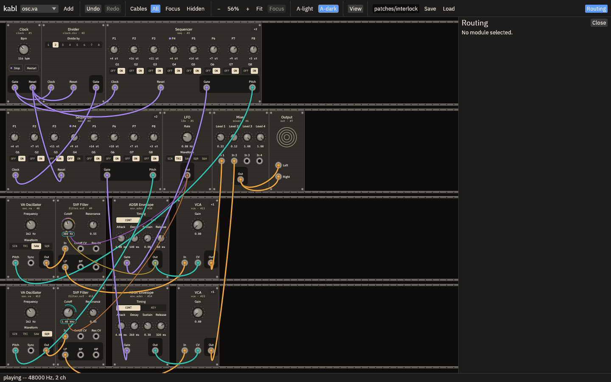 | 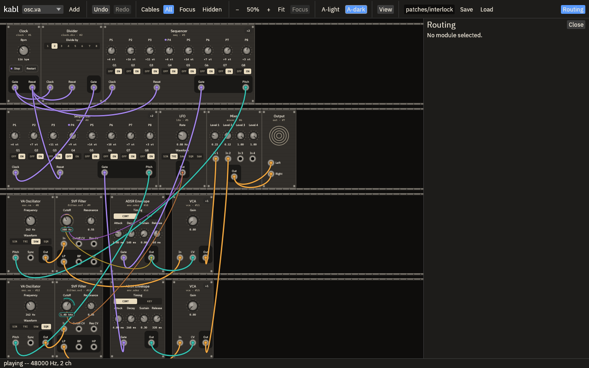 |
| lead expanded (transpose), light | 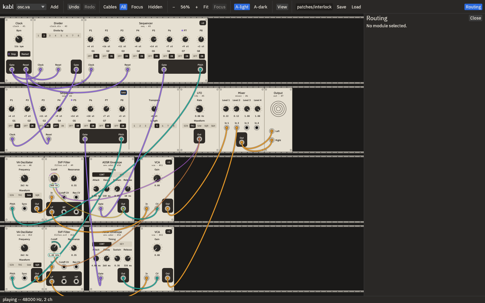 | 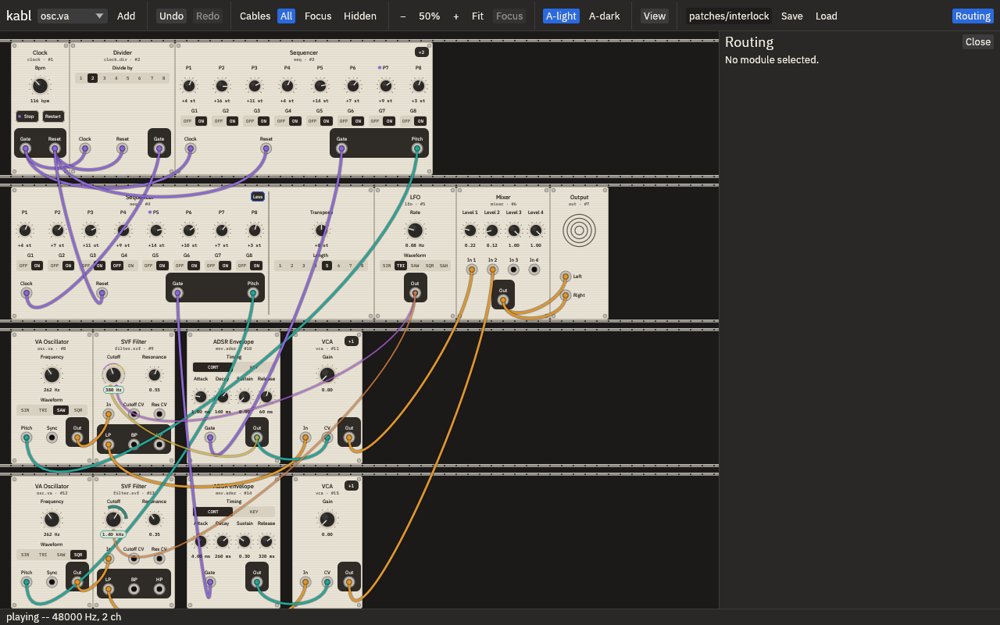 |
| lead expanded, dark | 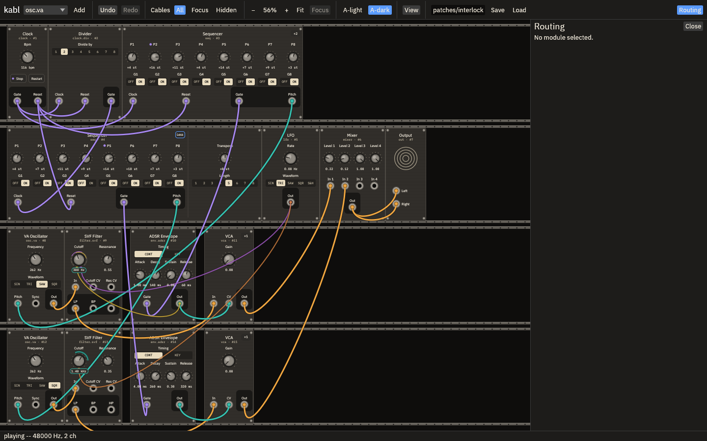 | 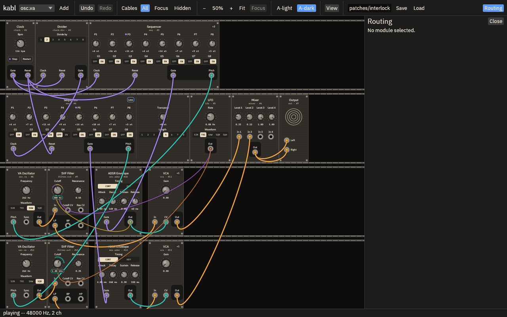 |
| stopped (button reads Run), dark |  |  |
| module panel pitch text, dark | 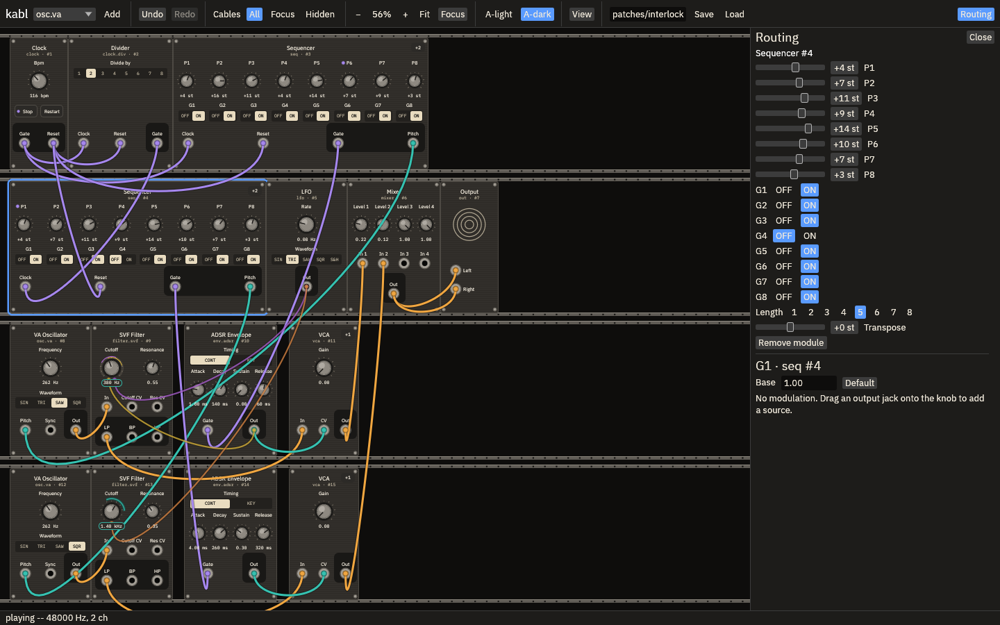 | 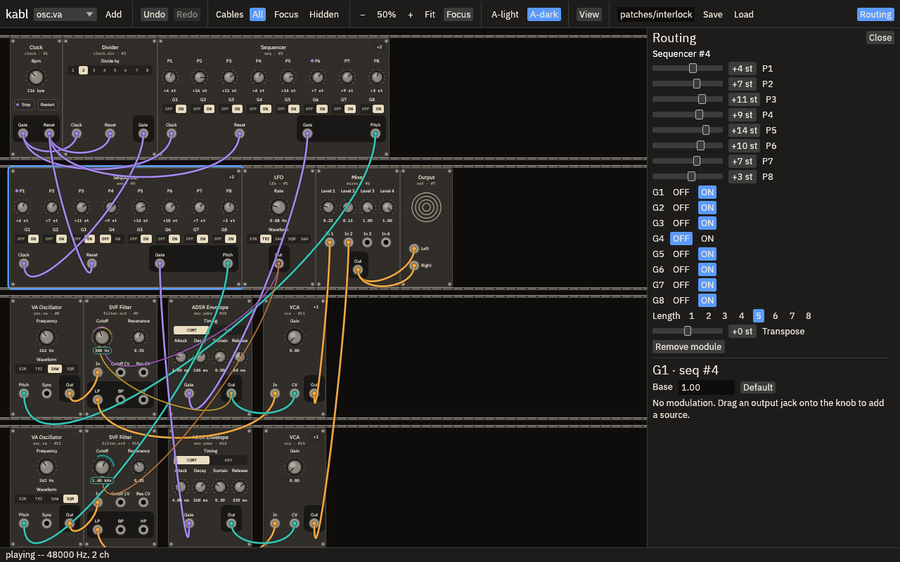 |
| module panel pitch text, light | 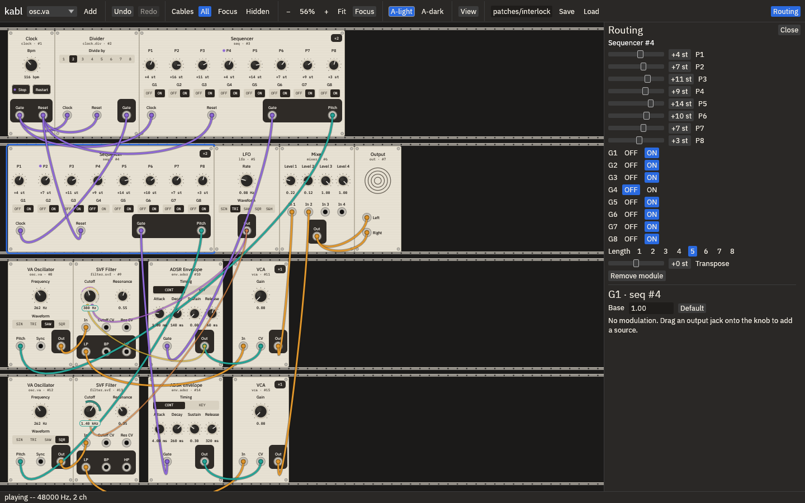 | 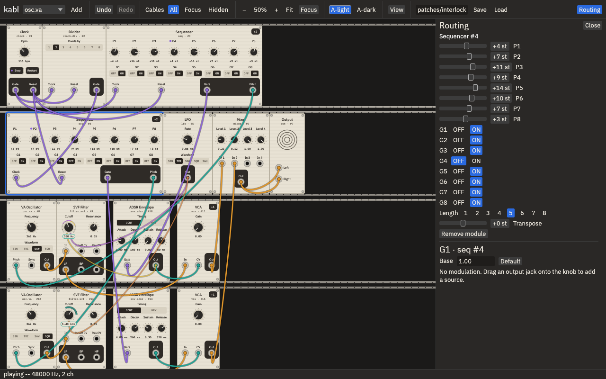 |

## Verification

`cargo test --workspace`: 218 pass (4 ignored, all fixture or script writers). `cargo clippy
--workspace --all-targets` is clean.

- `crates/modules/tests/transport.rs`: the sample-level timing, with no UI or engine. Clock →
  seq, and clock → divider → seq, with the reset patched everywhere. It checks:
  - division counts for 1–8, first pulse first, full pulse widths;
  - exact 6000-sample pulses at 120 bpm;
  - identical output for blocks of 1, 7, 37, 63 and 64 samples;
  - Stop during a pulse and between pulses, then Run: the next step, exactly once;
  - Run and Stop are idempotent, and a second Restart before Run is one Restart;
  - Restart while running on an edge, 1 sample after, the last high sample, the first low
    sample, just before an edge, and during a pulse the divider skips: both lines hit step 1 on
    the same sample, with no duplicate tick;
  - Restart while stopped waits for Run;
  - a reset during a skipped pulse does not switch it on mid-pulse, and a reset on an edge
    lets that pulse through;
  - a division change mid-pulse and between pulses commits on the next edge.
- `crates/engine/tests/interlocking.rs`: runs the committed patch through the real compiler and
  `PatchEngine`, with every audio-thread call under `assert_no_alloc`. It checks:
  - headroom, and both layers audible;
  - live edits keep every block's step identical to an unedited run: levels, transposes, a
    filter, overlapping swaps;
  - a BPM change keeps the step it is on;
  - Stop, Restart and Run with a crossfade in flight;
  - a Restart is not replayed by a later swap of the same graph (what an undo or reload would
    build).
- `crates/ui/tests/interaction.rs`: the transport buttons at both sizes are on screen and big
  enough to hit. They queue commands, add no op-log entry and trigger no rebuild, and the
  label follows the reported state. Transpose is advanced: a drag edits only it, the module
  panel writes nothing back, and undo restores it. `crates/ui/tests/interlocking.rs` checks
  that the committed patch equals its builder and that every stored param is in range.
  `routing.rs` checks the pitch labels.
- Existing checks unchanged and passing: `legacy_sound`, modulation, undo, `live_edit`,
  `compile_rt_safety`, `sequence_patch_plays_every_step`.

## Found during recording (fixed)

- The first recording showed ctrl+z not undoing a transpose drag. The module panel's slider
  used egui's `step_by(1.0)`. That snaps the shown value and reports a change every frame, so
  a stored 12.8 was rewritten as 13 and undo could never get past it. `step_by` is gone
  (`12c3bfe`), and the transpose test covers it.
- The first demo had a lead step at +26 st, above the 24 st range. The notes are the same now
  (transpose 0, steps 12 lower). The patch test checks ranges.

## Known limits / questions for Kosta

- At Fit zoom the four-row patch is small (56 % / 50 %). Everything is reachable by pan and
  zoom, as on any rack patch. A toolbar transport copy was not added: the toolbar is full at
  1280 px, and the clock face carries the reset jack that goes with it. Say if you want one.
- The divider's committed division is state, so it survives swaps. A division change to the
  same value is not a change, so it does not re-anchor the count.
- The step lights lag the audio by the UI frame (30 ms) plus the audio buffer, as before.
- Out of scope, not built: swing, probability, song arrangement, MIDI clock, effects,
  gate-length control.
