# Rack UI migration (production `kabl-ui`)

The approved revision-2 rack is now the production canvas. It draws from the real
`PatchEditor` / op log / engine state; nothing from the `rev2_proto` example's state, snapshot
undo or mock DSP was transplanted. The old Eurorack/Patchbay canvas is gone (see decisions.md).

    cargo run --release -p kabl-ui -- --patch patches/reference                  # 1440×900
    cargo run --release -p kabl-ui -- --patch patches/reference --size 1280x800
    cargo run --release -p kabl-ui -- --patch patches/crowded                    # 15 modules

## Before / after

Before: one free-form dark canvas (Eurorack grid or Patchbay), every param on every module,
one skinned module (`osc.va`, art with baked-in labels), a scroll area, no zoom, drawer always
open. After: the A-light / A-dark rack from the approved design (panel materials, IBM Plex type,
knob/jack/cable styling, output plates, rails), user-chosen faces with in-place expansion,
pan and zoom, closable drawer, skin renderer (plates or labels on art; no built-in ships a skin
yet). Modulation controls behave exactly as in the closed slice.

Screenshots are from the current build (`1e402cf`) unless under `img/historical/`.

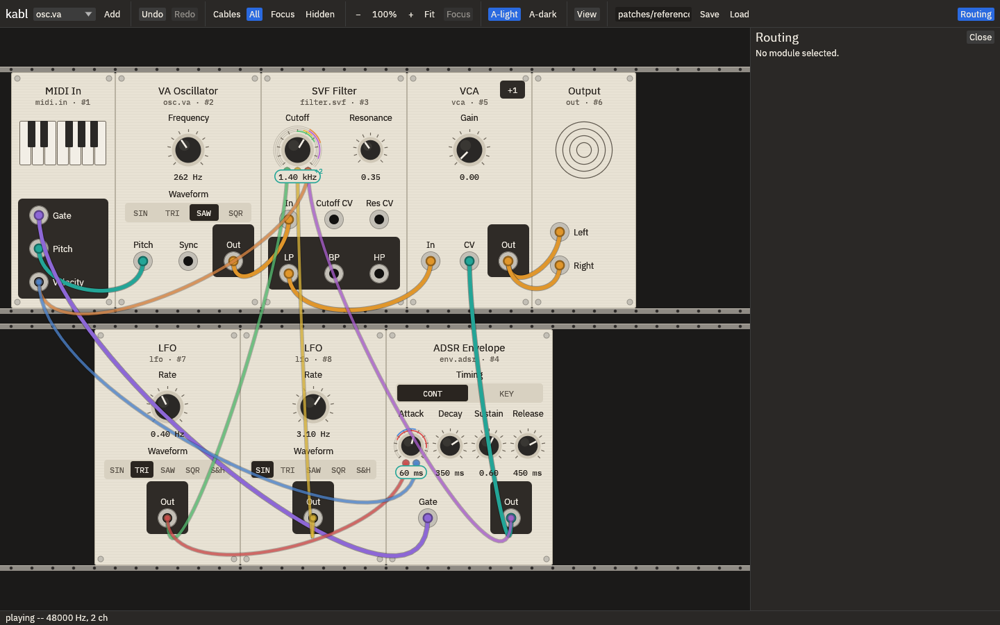
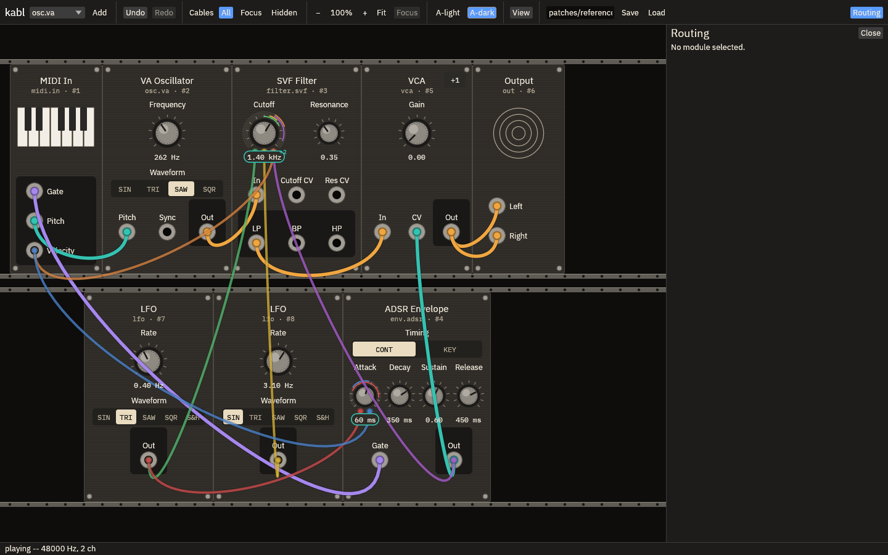

## Walkthrough

**View menu defaults.** Expansion pushes neighbours; *Illustrated skins* is on; *Preview
labels_on_art* is off.

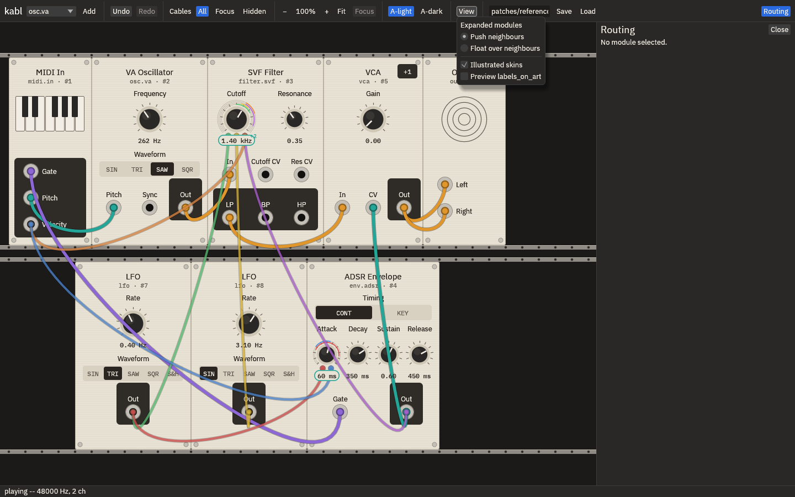

**Themes.** Toolbar `A-light` / `A-dark`. All nine built-ins, the toolbar and the drawer use
the approved palettes; chrome stays dark in both, as designed. View only, never saved.

**Cables.** `All` / `Focus` / `Hidden`, same stable rack. Hidden shows jack badges
(`> Filter`, `< MIDI`, `> 2 routes`), knob badges (`< LFO`, `< 2 mods`) and route dots.

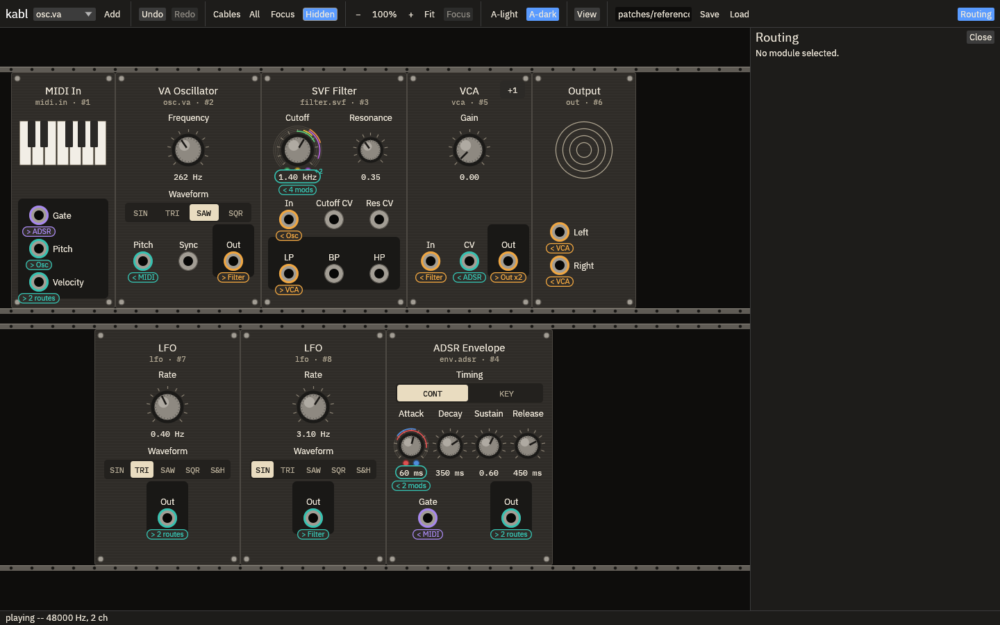

**Primary controls.** Each module declares its default face (`ModuleInfo.advanced` lists what
stays off it: `vca` Response). ADSR Timing is on the face (owner): CONT/KEY takes the
envelope picture's place, so the knobs sit exactly where they do with the picture. Right-click a module → *Choose primary
controls…*: the module expands, every control gets a pin (filled = on the face), the header
counts them; `Done` commits the whole choice as **one** undo step, `Esc` discards it.
*Reset face to module default* is in the same menu. The reference ADSR shows the default face
with Timing (every screenshot above). The choice is saved in the patch as
`face.<param>` params (1 on / 0 off / absent = default), which the compiler never reads:
choosing never rebuilds audio.

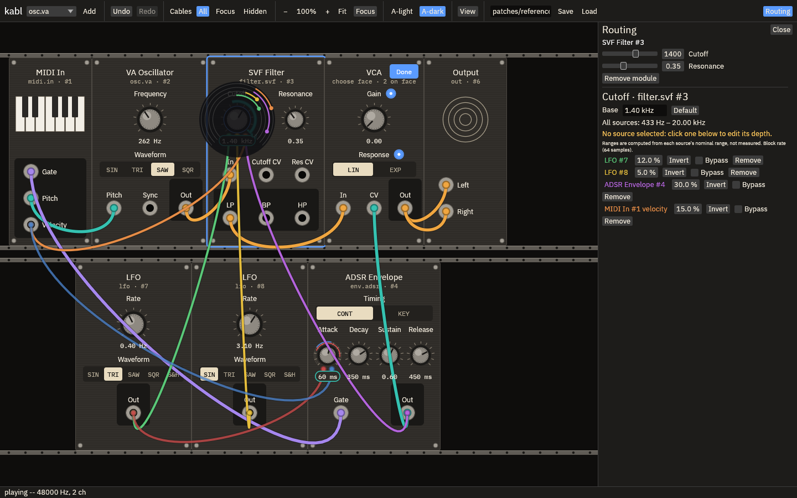
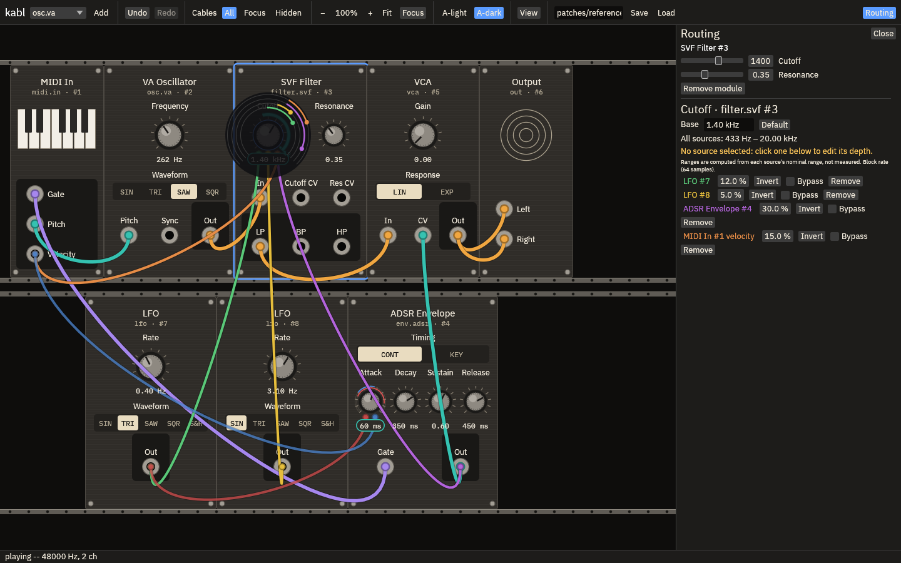

**Expansion.** `+N` in the header shows the advanced controls in place; `Less` hides them.
Face controls and jacks never move. Default **push**: modules to the right move by the
advanced width and come back exactly on collapse (layout-only; stored positions untouched).
*View → Float over neighbours*: the advanced area floats in its own layer, owns every press in
its visible area, and moves nothing. The rack pans to keep a just-expanded module in view.

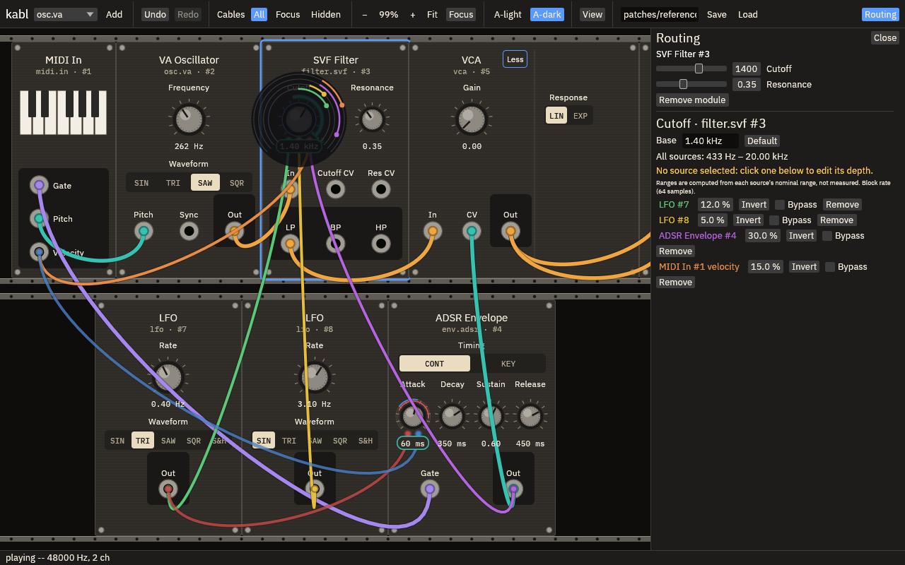
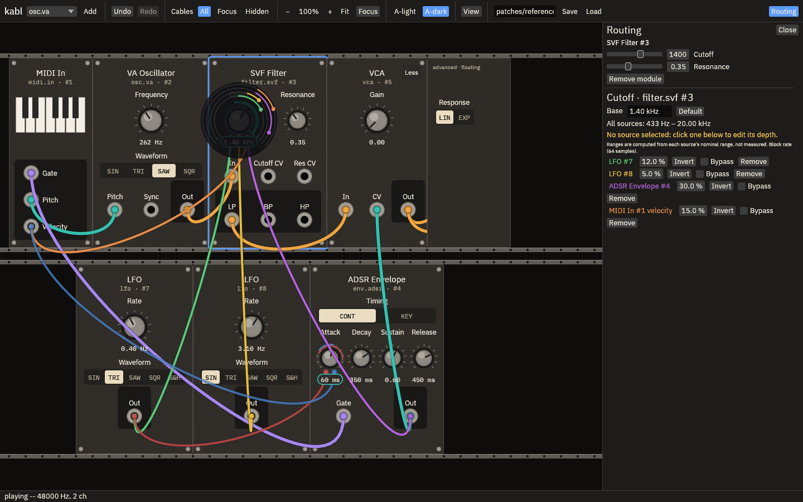

**Modulated controls off the face.** Their leads dock on the `+N` button, which gets a teal
ring (Hidden view: `1 hidden` badge) and a tooltip naming each route. Clicking the route's
cable (or anything that inspects that param) expands the module and flashes the control.

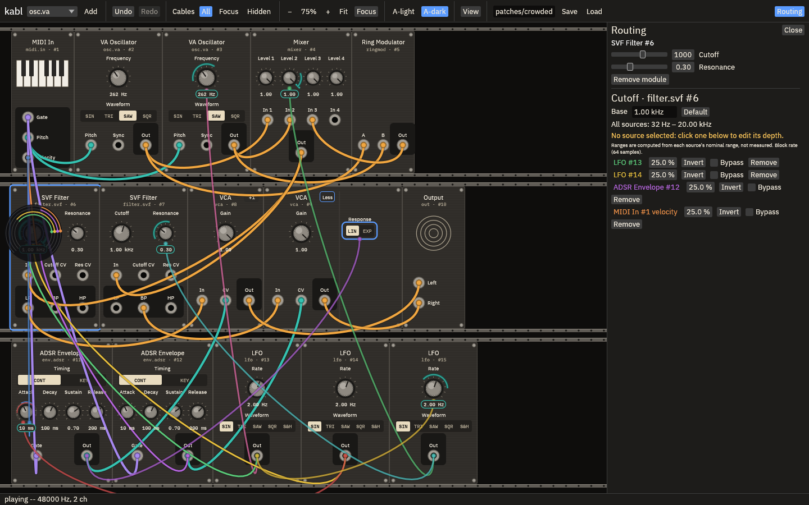

**Pan and zoom.** Drag bare rack or scroll to pan; Ctrl+wheel (or pinch) zooms about the
pointer, 50–200 %. Toolbar `−`, `100%`, `+`, `Fit`, `Focus` (the selected / inspected module
at ≥ 100 % when it fits). Panels, art, cables, rings, lanes, badges and hit regions share one
transform; toolbar and drawer stay at 100 %. Start-up fits the patch, never above 100 %.
Opening the drawer or resizing keeps the inspected control in view.

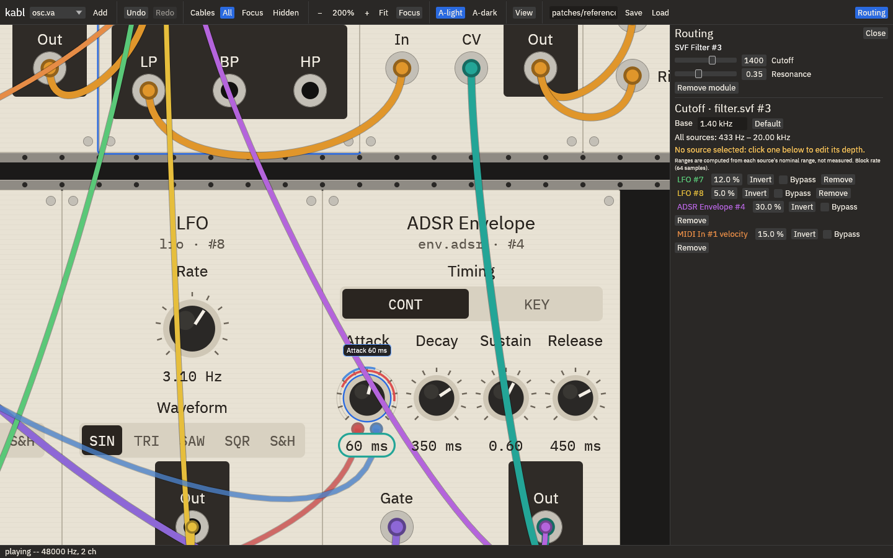
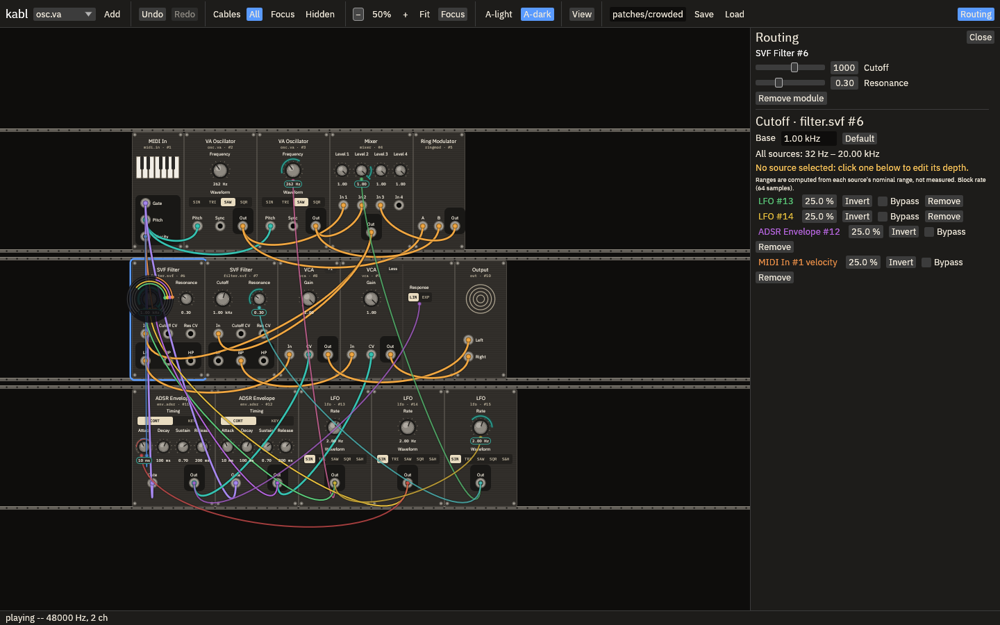
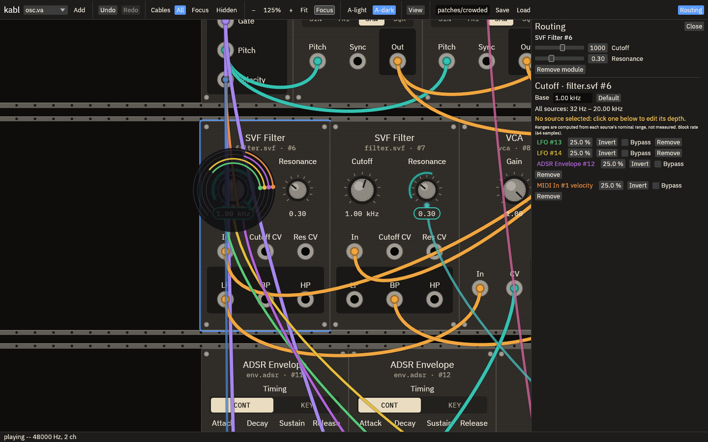

**Skins.** *View → Illustrated skins*, on by default. No built-in module ships a skin (the
`osc.va` placeholder demo was dropped at the owner's request), so the current rack shows no
art; the renderer stays and is covered by a test skin in `rack.rs`. For a skin,
`labels_on_art = false` (default) keeps labels and values on theme plates; *View → Preview
labels_on_art* shows the maker's `true` case. Historical screenshots of the dropped demo, for
reference only: [`img/historical/`](img/historical/).

**Cables.** Drag an output to an input or a knob. To move or remove a jack cable, pull its
plug out of the input and drop it on another input, a knob, or bare rack (one undo step; as
in VCV Rack and Voltage Modular). A click on a cable never deletes it; right-click →
*Remove cable* does.

**Modules.** Drag a panel to move it; it snaps to the nearest row and unit on release (one
undoable move, no audio rebuild).

**Source lanes at the edge.** Inspecting a knob (or adding a route to it) pans the rack, once
the pointer is up, just enough to show its whole lane disk, so no dot hides under the drawer
or the canvas edge; opening the drawer does the same. A drag in progress is never panned.

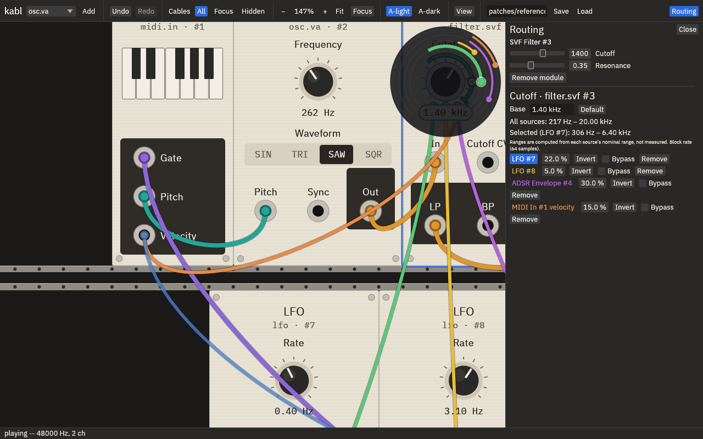
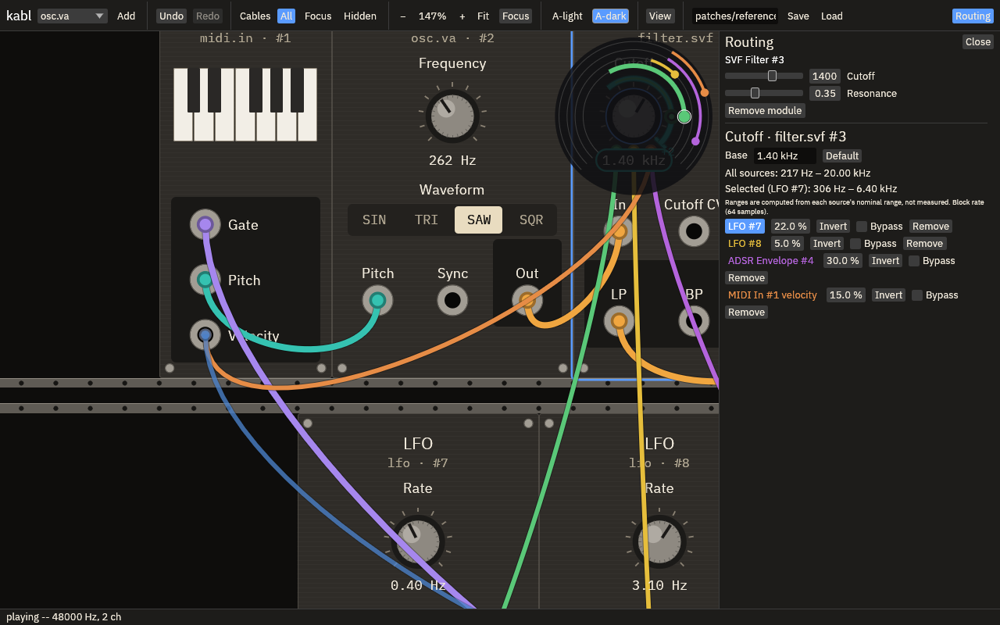

## Walkthrough video

[`walkthrough.mp4`](walkthrough.mp4) (49 s, 1440×900 scaled to 1280, real audio): chords play
throughout while Cutoff base is dragged down and up, the Cutoff lanes open and the envelope
and LFO dots are dragged (one with Shift), Hidden view, VCA push then float expansion, choose
mode (Response onto the face), A-dark, Ctrl+wheel zoom on Attack, an Attack lane dot drag, Fit.
Recorded by [`record-walkthrough.sh`](record-walkthrough.sh) (`scripts/walkthrough.txt`).

## Verification

**Measured / automated**
- `cargo test --workspace`: 193 pass, 0 fail (3 ignored: fixture/script writers). Clippy clean.
  `cargo fmt --check` clean except the untouched prototype examples.
- New regression tests, real egui input through `show()` at 1440×900 and 1280×800
  (`crates/ui/tests/interaction.rs`): primary choice = one undo step, saved/reloaded, undo
  restores "absent", Esc discards, no audio rebuild; push collapses back with zero drift, face
  controls and jacks never move; float moves nothing, a drag on the float over a neighbour
  neither moves nor selects it, drops land on the float's control; off-face route docks and is
  revealed on selection; after zoom ×1.5 about the pointer and a pan, knob hit rect scales ×1.5,
  ring +20 % per 30 px, Shift ×0.1, Escape leaves no undo entry, lane dot and undo work; view
  changes (theme, cable view, zoom, fit, expand, float, skins, drawer) leave patch, history and
  dirty flag untouched; `face.*` params render bit-identical audio; opening the drawer keeps
  the inspected knob left of it; a knob's lanes pan fully into view next to the drawer and at
  the bottom-left corner, and a dot there still drags. Layout unit tests (`rack.rs`): no overlaps, controls inside
  panels for every built-in in every face/expansion combination.
- Every existing modulation regression test still passes unchanged in intent (one was adapted:
  "click empty rack" finds bare rack itself). New: pulling a plug moves or removes a jack cable
  in one undo step, a click never deletes, pushing it back changes nothing.
- Real binary, real X input (xdotool via `drive.py`, which aims at the targets the app itself
  reports through `KABL_HITS_FILE`): the modulation closeout scenario
  (`closeout-real-x.sh`: new single-source dot, Shift, Escape on dot and body, Hidden view fine
  drag, removal with no reassignment, undo/redo, save) saves a patch **identical** to the
  headless run at 1440×900 and 1280×800.
- Mixer: the four channel levels are separate params now; an old stored `level` still sets all
  four and an old route to it still reaches channel 1 (`engine/tests/modulation.rs`).

**Inspected** (runtime screenshots, Xvfb + llvmpipe, `scripts/{tour,crowded,scale}.txt`):
both themes at both sizes, Hidden badges, lanes, push and float, choose mode, skin plates and
labels on art in both themes (before the demo skin was dropped), 50–200 % zoom, Focus,
crowded rack, display scale 1.25 zoomed (labels and hit areas aligned; a real drag landed on
the knob). Rerun on `1e402cf` at both sizes and both themes, drawer open, with pan and zoom
(`scripts/{tour,crowded,replug,edge,scale}.txt`); `img/` holds that run. Defects found
and fixed: drawer rows widened the drawer over the rack (clipped); the first drawer width
(336 px) overflowed the same way; lanes clipped at the canvas edge and drawer (fixed in
`1e402cf`: see *Source lanes at the edge*); the selected drawer row's source name was route
colour on the blue selection fill (now white).

**Unverified**
- Kosta's hands, display, scale factor, MIDI controller and sound card. Grab feel of dots vs
  ring vs body, now also at other zoom levels.
- Nobody has listened to `walkthrough.mp4` yet: the recording was checked by level only
  (mean −21 dB, peak −6.6 dB, no clipping), not by ear for clicks or zipper noise. The audio
  path is unchanged and presentation operations are shown not to rebuild or change audio.
- No built-in skin; no contrast warning for `labels_on_art` (the maker owns it).
- Pi 4 / low-end GPU rendering cost of the richer drawing.

## Limits (known, left)

Rich LFO controls are not shown (only real params exist). Selector routes show a plug, not the
reachable-options bracket. Lanes pan into view when a knob is inspected, not when the user later pans or zooms them off
the canvas (then they clip, by the user's choice). A module dragged far along a full row
inserts itself by stored x; there is no "make room" drag preview beyond the live packing.
Compact synth layout and x-ray cable fading are not built (out of scope).

Tools: [`drive.py`](drive.py) (xdotool driver), [`closeout-real-x.sh`](closeout-real-x.sh),
[`record-walkthrough.sh`](record-walkthrough.sh),
[`scripts/`](scripts/). Screenshots: [`img/`](img/).
